# VideoEngager Agent Standalone Demo

> **Built by VideoEngager Team** - A demonstration of receiving VideoEngager video calls in custom agent platforms without external contact center dependencies.

## Overview

This demo showcases the **VideoEngager Agent SDK in Standalone Mode**, enabling agents to receive and manage VideoEngager video calls directly in custom applications without requiring external contact center solutions.

### What is Standalone Mode?

Standalone Mode allows you to:
- ✅ Build custom agent interfaces with full control
- ✅ Receive video call notifications directly from VideoEngager
- ✅ Manage agent availability and queue status independently
- ✅ Handle incoming calls without third-party contact center platforms
- ✅ Implement your own call routing and distribution logic

## Architecture

### Call Flow Diagram

```mermaid
sequenceDiagram
    participant Visitor
    participant VE API
    participant VE Platform
    participant Agent App
    participant Agent

    Note over Visitor: 1. Generate Call URL
    Visitor->>VE API: POST /api/v1/calls<br/>(type: "outbound")
    VE API-->>Visitor: Call URL with sessionId

    Note over Visitor: 2. Start Video Call
    Visitor->>VE Platform: Open Call URL
    activate VE Platform

    Note over Agent App: 3. Agent Ready
    Agent App->>VE Platform: SDK init() + switchQueue()
    VE Platform-->>Agent App: Connected & On Queue

    Note over VE Platform: 4. Route Call
    VE Platform->>Agent App: 🔔 incomingCall Event
    Agent App->>Agent: Display Call Notification

    Note over Agent: 5. Accept Call
    Agent->>Agent App: Click "Accept"
    Agent App->>VE Platform: acceptCall(visitorId)
    
    VE Platform->>Agent App: Open Video Widget (iframe)
    VE Platform->>Visitor: Connect Call
    deactivate VE Platform

    Note over Agent,Visitor: 🎥 Video Call Active

    Agent->>Agent App: Click "End Call"
    Agent App->>VE Platform: endCall()
    VE Platform->>Agent App: sessionEnded Event
    VE Platform->>Visitor: Call Ended
```



## Quick Start

### Prerequisites

- VideoEngager account with API credentials
- Access to VideoEngager API for generating call URLs
- A web server to serve static files (Python, Node.js http-server, or VS Code Live Server, ...etc)

### Installation

**Note:** While the VideoEngager Agent SDK is available on npm (`npm install videoengager-agent-sdk`), this demo loads the SDK directly from CDN for simplicity.

1. **Set up the demo files**

Ensure you have these files in your project:
- `agent-standalone.html` - Main HTML interface  
- `main.mjs` - Business logic and SDK integration
- `ui-handler.mjs` - UI manipulation functions


For ES module imports in JavaScript:
```javascript
import { init, on, acceptCall } from 'https://cdn.jsdelivr.net/npm/videoengager-agent-sdk@latest/+esm';
```

2. **Serve the files**

Serve the files using any web server and open `agent-standalone.html` in your browser.

### Configuration

Fill in the configuration form with your VideoEngager credentials:

| Field | Description | Required | Example |
|-------|-------------|----------|---------|
| **Domain** | Your VideoEngager domain | ✅ Yes | `videome.leadsecure.com` |
| **API Key (PAK)** | Public API Key from VideoEngager | ✅ Yes | `your-api-key` |
| **Agent Email** | Agent's email address | ✅ Yes | `agent@company.com` |
| **Organization ID** | Your organization identifier | ✅ Yes | `org-12345` |
| **External ID** | Unique agent identifier | ✅ Yes | `agent-001` |

## How It Works - Business Logic

### Step 1: SDK Initialization

Import the SDK and initialize with your credentials:

```javascript
import { init, on, switchQueue, acceptCall, rejectCall, endCall } 
    from 'https://cdn.jsdelivr.net/npm/videoengager-agent-sdk@latest/+esm';

await init({
    authMethod: 'generic',
    apiKey: 'your-api-key',
    domain: 'videome.leadsecure.com',
    agentEmail: 'agent@company.com',
    organizationId: 'org-12345',
    externalId: 'agent-001',
    standaloneMode: true,
    logger: true,
    options: {
        containerId: 've-agent-container'
    }
});
```

**Key Configuration:**
- `standaloneMode: true` - Enables direct call notifications without contact center
- `containerId` - Where the video widget iframe gets injected
- `authMethod: 'generic'` - Required for standalone mode

### Step 2: Event Listeners

Register event handlers to react to SDK state changes:

```javascript
// 1. Monitor connection status
on('isOnline', (online) => {
    // Agent connected/disconnected to VideoEngager service
});

// 2. Monitor queue status changes
on('inCallsQueue', (isOnQueue) => {
    // Agent went on/off queue (receiving calls or not)
});

// 3. Incoming call notification
on('incomingCall', () => {
    const calls = getReceivedCalls(); // Get all queued calls
    // Display call notification to agent
});

// 4. Call removed from queue
on('callRemoved', () => {
    // Visitor hung up or another agent accepted
});

// 5. Video widget visibility changes
on('iframeStateChanged', (isOpen) => {
    // Show/hide call controls based on widget state
});
```

### Step 3: Queue Management

Agent must be online and on queue to receive calls:

```javascript
// Check connection first
if (isOnline()) {
    // Toggle queue on/off
    await switchQueue();
    
    if (isOnQueue()) {
        // Agent is now receiving calls
    }
}
```

### Step 4: Call Handling

Accept or reject incoming calls:

```javascript
// Accept call - opens video widget automatically
await acceptCall(visitorId);

// Reject call - removes from queue
await rejectCall(visitorId);

// End active call - closes video widget
await endCall();
```

### Step 5: UI Updates

Separate UI logic in `ui-handler.mjs` to keep business logic clean:

```javascript
import * as UI from './ui-handler.mjs';

// Update UI based on SDK events
on('isOnline', (online) => UI.updateConnectionStatus(online));
on('inCallsQueue', (inQueue) => UI.updateQueueStatus(inQueue));
on('incomingCall', () => UI.renderCalls(getReceivedCalls()));
on('iframeStateChanged', (isOpen) => UI.toggleCallControls(isOpen));
```

### Visitor Call Initiation

Visitors initiate calls by opening a URL generated via the VideoEngager API:

```bash
curl 'https://videome.leadsecure.com/api/interactions/tenants/{tenantId}/interactions' \
  --request POST \
  --header 'Content-Type: application/json' \
  --data '{"type": "OUTBOUND"}'
```

This returns a visitor URL that triggers the `incomingCall` event when opened.

## File Structure

### Component Architecture

```
┌─────────────────────────────────────────────────────────────┐
│                    agent-standalone.html                    │
│  ┌──────────────────────────────────────────────────────┐  │
│  │                   UI Layer (HTML)                     │  │
│  │  • Configuration Form                                 │  │
│  │  • Agent Dashboard                                    │  │
│  │  • Call Queue Display                                 │  │
│  │  • Video Container (ve-agent-container)               │  │
│  └──────────────────────────────────────────────────────┘  │
└─────────────────────────────────────────────────────────────┘
                            ▼
┌─────────────────────────────────────────────────────────────┐
│                        main.mjs                             │
│  ┌──────────────────────────────────────────────────────┐  │
│  │              Business Logic Layer                     │  │
│  │  • VideoEngager SDK Integration                       │  │
│  │  • Event Handling (isOnline, incomingCall, etc.)     │  │
│  │  • Call Operations (accept, reject, end)              │  │
│  │  • Queue Management (switchQueue)                     │  │
│  └──────────────────────────────────────────────────────┘  │
└─────────────────────────────────────────────────────────────┘
                            ▼
┌─────────────────────────────────────────────────────────────┐
│                      ui-handler.mjs                         │
│  ┌──────────────────────────────────────────────────────┐  │
│  │                UI Manipulation Layer                  │  │
│  │  • DOM Element References                             │  │
│  │  • Status Updates (connection, queue)                 │  │
│  │  • Call List Rendering                                │  │
│  │  • Error Display                                      │  │
│  └──────────────────────────────────────────────────────┘  │
└─────────────────────────────────────────────────────────────┘
                            ▼
┌─────────────────────────────────────────────────────────────┐
│              VideoEngager Agent SDK (npm)                   │
│  • WebSocket Connection to VideoEngager Platform            │
│  • Event Emitters (incomingCall, sessionStarted, etc.)      │
│  • Call Management APIs                                     │
│  • Video Widget Iframe Injection                            │
└─────────────────────────────────────────────────────────────┘
```
## File Descriptions
### `agent-standalone.html`

The main HTML interface containing:
- **Configuration Form**: Collects agent credentials
- **Agent Dashboard**: Shows connection status, queue status, and incoming calls
- **Video Container**: `<div id="ve-agent-container">` where the SDK injects the video widget
- **Call Controls**: Accept/Reject buttons and End Call button

**Technologies:**
- Tailwind CSS (via CDN) for styling
- Lucide Icons (via CDN) for UI icons
- VideoEngager Agent SDK (via jsdelivr CDN - `https://cdn.jsdelivr.net/npm/videoengager-agent-sdk@latest/+esm`)

### `main.mjs`

Business logic module handling:
- SDK initialization with `init()`
- Event listener setup for SDK events
- Call operations (accept, reject, end)
- Queue management (switchQueue)
- Connection state tracking

**Key Functions:**
- `initializeAgent(config)` - Initialize SDK with credentials
- `setupEventListeners()` - Register SDK event handlers
- `toggleQueue()` - Switch agent on/off queue
- `acceptCallCallback(callerId)` - Accept incoming call
- `rejectCallCallback(callerId)` - Reject incoming call
- `endCallCallback()` - End active call

### `ui-handler.mjs`

Pure UI manipulation module providing:
- DOM element references (`elements` object)
- Status update functions (`updateConnectionStatus`, `updateQueueStatus`)
- Call list rendering (`renderCalls`)
- Error display (`showError`)
- Button state management
- Form value extraction

**Separation of Concerns:**
- All `document.getElementById()` calls are in ui-handler.mjs
- All Tailwind class manipulation is in ui-handler.mjs
- main.mjs only calls UI functions, never touches DOM directly

## SDK Event Reference

| Event | Payload | Description |
|-------|---------|-------------|
| `isOnline` | `boolean` | Connection to VideoEngager service changed |
| `inCallsQueue` | `boolean` | Agent queue status changed (on/off queue) |
| `incomingCall` | `void` | New call notification received |
| `callRemoved` | `string` | Call removed from queue (visitor hung up) |
| `iframeStateChanged` | `boolean` | Video widget opened/closed |
| `sessionStarted` | `CallState` | Video session successfully started |
| `sessionEnded` | `CallState` | Video session ended |
| `sessionFailed` | `Error` | Video session failed to start |

## SDK Method Reference

| Method | Parameters | Returns | Description |
|--------|------------|---------|-------------|
| `init(config)` | `InitConfig` | `Promise<void>` | Initialize SDK and connect to VideoEngager |
| `isOnline()` | - | `boolean` | Check if connected to notification service |
| `isOnQueue()` | - | `boolean` | Check if agent is receiving calls |
| `switchQueue()` | - | `Promise<void>` | Toggle agent queue status (on/off) |
| `getReceivedCalls()` | - | `Array<Call>` | Get list of incoming calls in queue |
| `acceptCall(visitorId)` | `string` | `Promise<void>` | Accept incoming call |
| `rejectCall(visitorId)` | `string` | `Promise<void>` | Reject incoming call |
| `endCall()` | - | `Promise<void>` | End current active call |

## Best Practices

### 1. Always Check Connection Before Queue Operations

```javascript
if (!isOnline()) {
    UI.showError('Cannot toggle queue: Agent is offline');
    return;
}
await switchQueue();
```

### 2. Handle Concurrent Call Scenarios

```javascript
on('incomingCall', async (notification) => {
    const calls = getReceivedCalls();
    
    if (calls.length > 1) {
        console.log('Multiple calls queued - implement priority logic');
    }
});
```

### 3. Graceful Error Handling

```javascript
try {
    await acceptCall(visitorId);
} catch (error) {
    if (error.code === 'session|already-active') {
        UI.showError('Already in a call');
    } else {
        UI.showError(`Failed to accept: ${error.message}`);
    }
}
```

### 4. Monitor Connection Health

```javascript
on('isOnline', (online) => {
    if (!online) {
        // Log to monitoring service
        console.error('⚠️ Agent disconnected - alerts should be triggered');
    }
});
```

## Troubleshooting

### Issue: Not Receiving Incoming Calls

**Checklist:**
1. ✅ Verify `standaloneMode: true` in init config
2. ✅ Check agent is online: `isOnline() === true`
3. ✅ Check agent is on queue: `isOnQueue() === true`
4. ✅ Verify event listener is registered: `on('incomingCall', handler)`
5. ✅ Confirm visitor call URL was generated with correct `organizationId`

### Issue: Video Widget Not Opening

**Checklist:**
1. ✅ Verify `containerId` element exists in HTML
2. ✅ Check browser console for errors
3. ✅ Ensure `acceptCall()` resolved successfully
4. ✅ Verify domain configuration is correct

### Issue: Queue Toggle Not Working

**Solution:**
```javascript
// Always check online status first
if (!isOnline()) {
    console.error('Agent must be online to toggle queue');
    return;
}
await switchQueue();
```

## Documentation & Resources

- **VideoEngager Agent SDK**: [npm package](https://www.npmjs.com/package/videoengager-agent-sdk)
- **API Documentation**: Contact VideoEngager support for API access
- **Support**: support@videoengager.com

## Advanced Features

### Custom Call Routing

Implement priority-based call routing:

```javascript
on('incomingCall', async () => {
    const calls = getReceivedCalls();
    
    // Sort by priority (example: based on metadata)
    const prioritized = calls.sort((a, b) => {
        // sort logic here
    });
    
    // Auto-accept highest priority
    if (prioritized[0]) {
        await acceptCall(prioritized[0].caller.id);
    }
});
```

### Call Metrics Tracking

Track agent performance:

```javascript
let metrics = {
    callsAccepted: 0,
    callsRejected: 0,
    avgCallDuration: 0
};

on('sessionStarted', (state) => {
    metrics.callsAccepted++;
    state.startTime = Date.now();
});

on('sessionEnded', (state) => {
    const duration = Date.now() - state.startTime;
    metrics.avgCallDuration = 
        (metrics.avgCallDuration * (metrics.callsAccepted - 1) + duration) 
        / metrics.callsAccepted;
    
    console.log('Metrics:', metrics);
});
```

## License

This demo is provided by VideoEngager as a reference implementation. For licensing and terms of use, refer to your VideoEngager service agreement.

---

**Built with ❤️ by the VideoEngager Team**

For questions, issues, or feature requests, please contact VideoEngager support.
