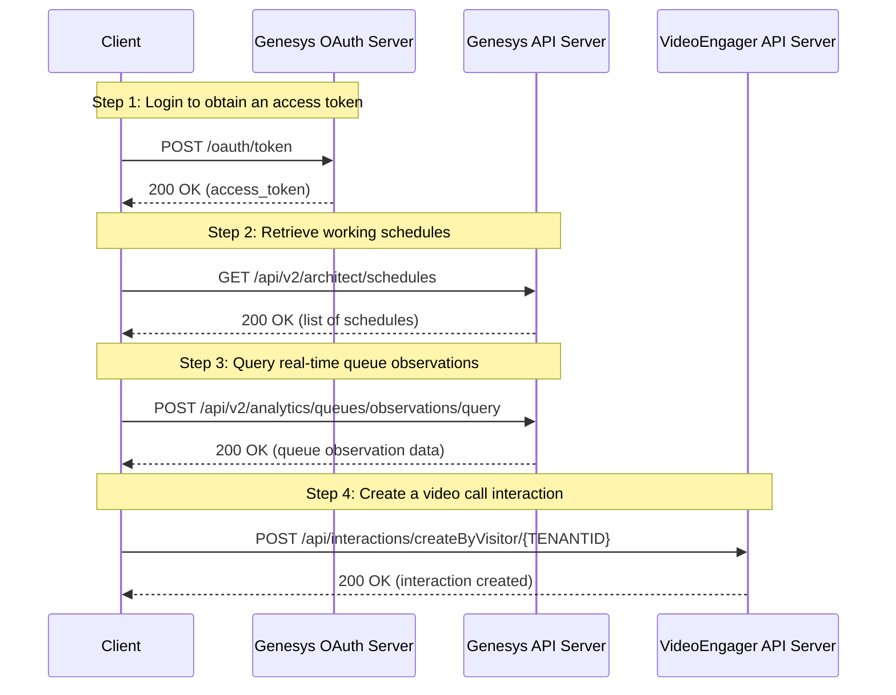

```mermaid
sequenceDiagram
    participant Client
    participant OAuthServer as Genesys OAuth Server
    participant GenesysAPI as Genesys API Server
    participant VideoEngagerAPI as VideoEngager API Server

    Note over Client,OAuthServer: Step 1: Login to obtain an access token
    Client->>OAuthServer: POST /oauth/token
    OAuthServer-->>Client: 200 OK (access_token)

    Note over Client,GenesysAPI: Step 2: Retrieve working schedules
    Client->>GenesysAPI: GET /api/v2/architect/schedules
    GenesysAPI-->>Client: 200 OK (list of schedules)

    Note over Client,GenesysAPI: Step 3: Query real-time queue observations
    Client->>GenesysAPI: POST /api/v2/analytics/queues/observations/query
    GenesysAPI-->>Client: 200 OK (queue observation data)

    Note over Client,VideoEngagerAPI: Step 4: Create a video call interaction
    Client->>VideoEngagerAPI: POST /api/interactions/createByVisitor/{TENANTID}
    VideoEngagerAPI-->>Client: 200 OK (interaction created)
```
