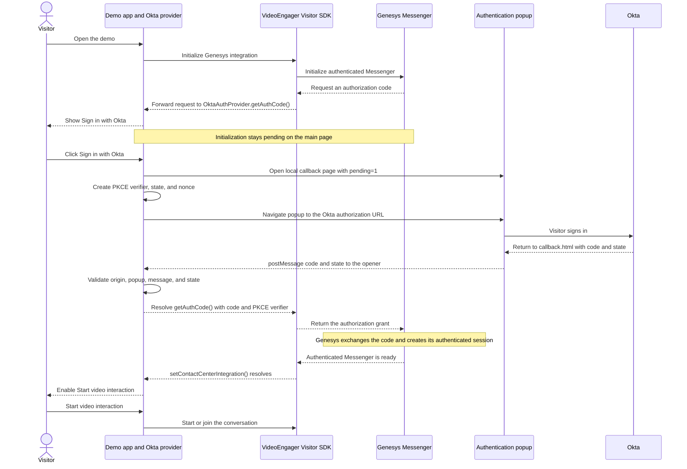

# VideoEngager + Genesys Authenticated Messenger (Popup Login)

This demo shows how to start a VideoEngager video interaction from the
VideoEngager Visitor SDK when the Genesys Messenger deployment requires user
authentication.

Okta sign-in runs in a popup, so the main demo page does not refresh. Okta is
only the example OpenID Connect (OIDC) provider; replace the files in `auth/`
if your application uses another provider.

## What you need

- A Genesys Messenger deployment with authentication enabled.
- A VideoEngager environment and tenant ID.
- An Okta OIDC web application with a client ID and authorization endpoint.
- A browser that allows popups for the demo site.

The VideoEngager Visitor SDK is already loaded from the VideoEngager CDN in
`index.html`.

> Need credentials or access to a test environment? Contact
> [VideoEngager Support](https://help.videoengager.com/hc/en-us/requests/new).
> VideoEngager can help grant the required test access and configuration.

## 1. Configure VideoEngager and Genesys

Open `app.js` and update:

| Configuration | Required values |
| --- | --- |
| `GENESYS_CONFIG` | `domain`, `deploymentId` |
| `VIDEOENGAGER_CONFIG` | `veEnv`, `tenantId` |

## 2. Configure Okta

Open `auth/okta-auth-provider.js` and update `OKTA_CONFIG`:

| Value | Description |
| --- | --- |
| `authorizationEndpoint` | Copy this from your Okta OIDC metadata. Do not guess the URL. |
| `clientId` | The client ID of your Okta OIDC application. |
| `scopes` | Usually `openid`, `profile`, and `email`. |

Add the exact callback URL to the **Sign-in redirect URIs** in your Okta
application. For the default local setup, use:

```text
http://localhost:5500/examples/genesys-messenger-authenticated/visitor-sdk-popup/auth/callback.html
```

The protocol, hostname, port, path, and trailing slash must match exactly.
The callback page must use the same origin as the main demo page.

> Never put an Okta client secret in browser JavaScript. This demo uses
> Authorization Code with PKCE and only needs a client ID.

## 3. Run the demo

Serve the repository with VS Code Live Server or another static web server.
Do not open `index.html` directly from the file system.

The expected result is:

1. Genesys requests an authorization code and the page displays
   **Sign in with Okta**.
2. Clicking the button opens the Okta sign-in popup.
3. The main page stays loaded while its Genesys initialization waits.
4. After sign-in, the popup sends the code to the main page and closes.
5. The main page changes to **Authenticated and ready** without refreshing.
6. The **Start video interaction** button becomes available.

## Authentication flow

This popup demo initializes only once. The Genesys authorization request and
`setContactCenterIntegration()` remain pending while the visitor signs in.
Only the popup navigates to Okta; the main page is never redirected or
reloaded.



If Genesys later requests a fresh grant, the same sign-in button and popup
flow runs again.

## If it does not work

- **Popup blocked:** allow popups for the demo site and click the sign-in
  button again.
- **404 in the popup:** the Okta redirect URI is wrong or the web server is
  not serving `auth/callback.html`.
- **Stuck after sign-in:** confirm the callback and main page use the same
  origin, verify the Okta and Genesys values, and check the browser console.

For Genesys authentication details, see the
[Genesys Authenticated Messenger documentation](https://developer.genesys.cloud/commdigital/digital/webmessaging/messengersdk/authenticatedMessenger).
