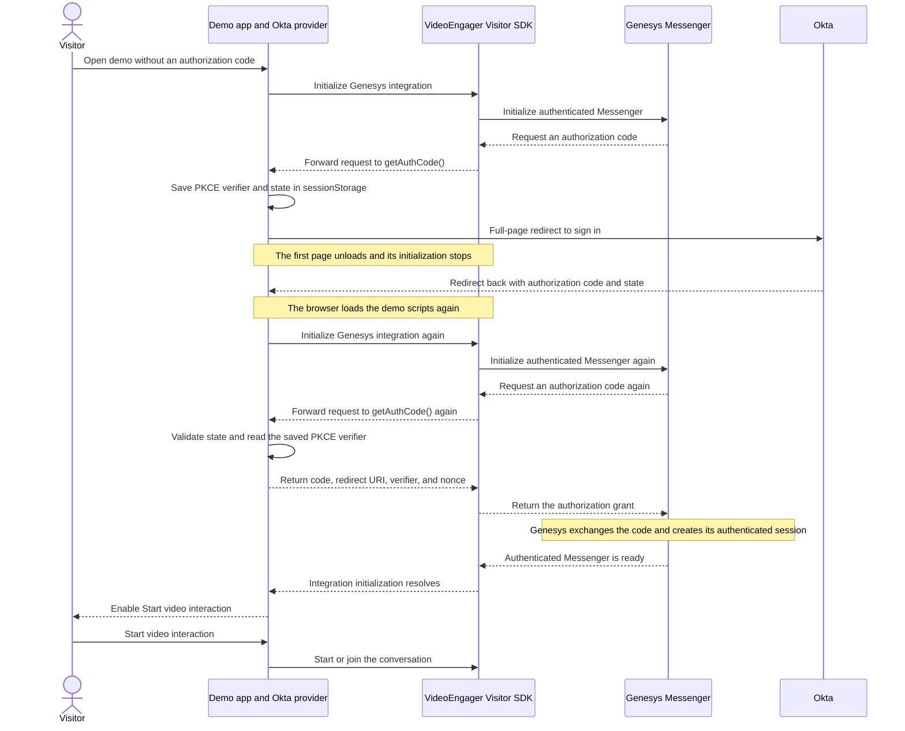

# VideoEngager + Genesys Authenticated Messenger

This demo shows how to start a VideoEngager video interaction from the
VideoEngager Visitor SDK when the Genesys Messenger deployment requires user
authentication.

The demo uses **Okta** as the example OpenID Connect (OIDC) provider. You can
replace `okta-auth-provider.js` if your application uses another provider.

## What you need

- A Genesys Messenger deployment with authentication enabled.
- A VideoEngager environment and tenant ID.
- An Okta OIDC web application with a client ID and authorization endpoint.
- The VideoEngager Visitor SDK UMD bundle (`main.umd.js`).

> Need credentials or access to a test environment? Contact
> [VideoEngager Support](https://help.videoengager.com/hc/en-us/requests/new).
> VideoEngager can help grant the required test access and configuration.

## 1. Configure the demo

Open `app.js` and update `CONFIG`:

| Section | Required values |
| --- | --- |
| `okta` | `authorizationEndpoint`, `clientId` |
| `genesys` | `domain`, `deploymentId` |
| `videoEngager` | `veEnv`, `tenantId` |

Copy the authorization endpoint from your Okta OIDC metadata. Do not build or
guess the URL.

Add the exact demo URL to the **Sign-in redirect URIs** in your Okta
application. For the default local setup, use:

```text
http://localhost:5500/examples/genesys-messenger-authenticated/visitor-sdk/index.html
```

The protocol, hostname, port, path, and trailing slash must match the URL in
the browser.

> Never put an Okta client secret in browser JavaScript. This demo uses
> Authorization Code with PKCE and only needs a client ID.

## 2. Load the Visitor SDK

`index.html` currently loads the development bundle from:

```text
http://127.0.0.1:5501/packages/browser/dist/main.umd.js
```

Run that development server, or place `main.umd.js` in this folder and change
the script source to:

```html
<script src="./main.umd.js"></script>
```

## 3. Run the demo

Serve the repository with VS Code Live Server or another static web server.
Do not open `index.html` directly from the file system.

Open the demo URL. The expected result is:

1. Genesys requests an authorization code and the browser redirects to Okta.
2. After sign-in, Okta returns to this page and the demo initializes again.
3. The saved PKCE data and returned code complete Genesys authentication.
4. The status changes to **Authenticated and ready**.
5. The **Start video interaction** button becomes available.

## Authentication flow

This full-page redirect demo initializes twice. The first initialization
starts Okta sign-in. The second initialization reads the callback and
completes Genesys authentication.



## If it does not work

- **404 after Okta sign-in:** the Okta redirect URI does not exactly match the
  running demo URL, or the web server is not serving that path.
- **`main.umd.js` error:** fix the SDK `<script>` URL in `index.html`.
- **Stuck on “Authenticating with Okta”:** verify the Okta and Genesys values,
  then check the browser console for the exact error.

For Genesys authentication details, see the
[Genesys Authenticated Messenger documentation](https://developer.genesys.cloud/commdigital/digital/webmessaging/messengersdk/authenticatedMessenger).
