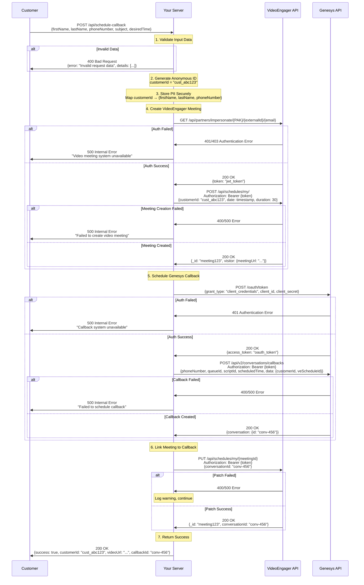

# VideoEngager + Genesys Cloud Callback Integration

A Node.js demonstration server that integrates VideoEngager video meetings with Genesys Cloud callback scheduling while maintaining customer data privacy.

## 🏗️ Architecture Overview

This integration creates a seamless experience where customers can schedule both a video meeting and a phone callback simultaneously. The system maintains data privacy by using anonymous customer IDs for external API calls while securely storing PII on your servers.

### Key Features

- **Privacy-First Design**: Customer PII never leaves your servers
- **Dual Integration**: Simultaneous VideoEngager meeting + Genesys callback creation
- **Anonymous Processing**: External APIs only receive anonymous customer IDs
- **Security Hardened**: Rate limiting, input validation, XSS protection
- **Production Ready**: Comprehensive logging, error handling, health checks

## 📋 Prerequisites

Before you begin, ensure you have:

- **Node.js** 16.0 or higher
- **npm** or **yarn** package manager
- **VideoEngager Account** with:
  - Partner Access Key (PAK)
  - External ID
  - Authorized email address
  - Domain (dev.videoengager.com, staging.videoengager.com, or production)
- **Genesys Cloud Organization** with:
  - OAuth Client ID and Secret
  - Queue ID for routing callbacks
  - Script ID for callback handling
  - Appropriate permissions for callback API

## 🚀 Quick Start

### 1. Clone and Install

```bash
# Clone the repository
git clone <repository-url>
cd videoengager-genesys-integration

# Install dependencies
npm install
```

### 2. Environment Configuration

Copy the example environment file and configure your settings:

```bash
cp .env.example .env
```

Edit `.env` with your configuration:

```env
# Server Configuration
PORT=3002
NODE_ENV=development

# VideoEngager Configuration
VE_DOMAIN=dev.videoengager.com
VE_PAK=your-partner-access-key
VE_EXTERNAL_ID=your-external-id
VE_EMAIL=your-authorized-email@company.com

# Genesys Cloud Configuration
GENESYS_ENVIRONMENT=mypurecloud.com
GENESYS_CLIENT_ID=your-oauth-client-id
GENESYS_CLIENT_SECRET=your-oauth-client-secret
GENESYS_QUEUE_ID=your-queue-id
GENESYS_SCRIPT_ID=your-script-id
```

### 3. Start the Server

```bash
# Development mode with auto-reload
npm run dev

# Production mode
npm start
```

The server will start on `http://localhost:3002` (or your configured PORT).

## 🔧 Detailed Configuration

### VideoEngager Setup

1. **Obtain Credentials**:
   - Contact VideoEngager support for your PAK (Partner Access Key)
   - Get your External ID from your VideoEngager admin panel
   - Ensure your email is authorized for API access

2. **Domain Selection**:
   - `dev.videoengager.com` - Development/testing
   - `staging.videoengager.com` - Staging environment
   - `videome.leadsecure.com` - Production environment

3. **Test Authentication**:
   ```bash
   curl "https://dev.videoengager.com/api/partners/impersonate/YOUR_PAK/YOUR_EXTERNAL_ID/YOUR_EMAIL"
   ```

### Genesys Cloud Setup

1. **Create OAuth Client**:
   - Login to Genesys Cloud Admin
   - Go to Admin → Integrations → OAuth
   - Create new OAuth client with `client_credentials` grant type
   - Note the Client ID and Secret

2. **Configure Permissions**:
   Required OAuth scopes:
   - `conversations:callback:create`
   - `conversations:callback:read`

3. **Get Queue and Script IDs**:
   - **Queue ID**: Admin → Contact Center → Queues → Select queue → Copy ID from URL
   - **Script ID**: Admin → Contact Center → Scripts → Select script → Copy ID from URL

4. **Test Authentication**:
   ```bash
   curl -X POST "https://login.mypurecloud.com/oauth/token" \
     -H "Content-Type: application/x-www-form-urlencoded" \
     -d "grant_type=client_credentials&client_id=YOUR_CLIENT_ID&client_secret=YOUR_CLIENT_SECRET"
   ```

## 📡 API Endpoints

### POST /api/schedule-callback

Schedules both a VideoEngager meeting and Genesys callback.

**Request Body:**
```json
{
  "firstName": "John",
  "lastName": "Doe",
  "phoneNumber": "+1-555-123-4567",
  "subject": "Product inquiry",
  "desiredTime": "2024-12-25T15:30:00.000Z"
}
```

**Success Response (200):**
```json
{
  "success": true,
  "customerId": "cust_abc123",
  "videoUrl": "https://dev.videoengager.com/ve/meeting123",
  "callbackId": "conv-456-789",
  "scheduledTime": "2024-12-25T15:30:00.000Z",
  "message": "Callback and video meeting scheduled successfully"
}
```

**Error Response (400/500):**
```json
{
  "error": "Invalid request data",
  "details": ["Phone number is required"],
  "requestId": "req-123-456"
}
```

### GET /api/health

Returns system health and service status.

**Response:**
```json
{
  "status": "healthy",
  "timestamp": "2024-12-25T12:00:00.000Z",
  "version": "1.0.0",
  "environment": "development",
  "uptime": 3600,
  "services": {
    "videoEngager": { "status": "healthy" },
    "genesys": { "status": "healthy" }
  }
}
```

### GET /api/customer/:id

Retrieves customer data by anonymous ID (for testing/admin purposes).

## 🔒 Security Features

### Input Validation
- Comprehensive request validation
- XSS prevention
- SQL injection protection
- Phone number format validation
- Date/time validation

### Rate Limiting
- General: 100 requests per 15 minutes per IP
- API endpoints: 20 requests per 15 minutes per IP

### Security Headers
- Content Security Policy (CSP)
- HSTS (HTTP Strict Transport Security)
- X-Frame-Options
- X-Content-Type-Options

### Data Privacy
- PII stored only on your servers
- Anonymous customer IDs for external APIs
- Automatic data cleanup (24-hour TTL)

## 🔄 Integration Flow



## 🧪 Testing

### Test the Frontend
1. Open `http://localhost:3002` in your browser
2. Fill out the callback form
3. Submit and verify both video meeting and callback are created

### Test API Directly
```bash
# Test callback scheduling
curl -X POST http://localhost:3002/api/schedule-callback \
  -H "Content-Type: application/json" \
  -d '{
    "firstName": "Test",
    "lastName": "User", 
    "phoneNumber": "+1-555-123-4567",
    "subject": "API Test",
    "desiredTime": "2024-12-25T15:30:00.000Z"
  }'

# Test health endpoint
curl http://localhost:3002/api/health
```

### Verify in External Systems

**VideoEngager:**
- Login to your VideoEngager admin panel
- Check Schedules section for new meeting
- Verify customer URL is accessible

**Genesys Cloud:**
- Go to Admin → Contact Center → Interactions
- Look for scheduled callback with matching phone number
- Verify custom data contains anonymous customer ID

## 🐛 Troubleshooting

### Common Issues

**1. Authentication Errors**
```
Error: Failed to authenticate with VideoEngager
```
- Verify PAK, External ID, and email are correct
- Ensure email is authorized in VideoEngager
- Check if domain is correct (dev vs staging vs production)

**2. Genesys OAuth Errors**
```
Error: Failed to authenticate with Genesys
```
- Verify Client ID and Secret are correct
- Check OAuth client has required scopes
- Ensure client uses `client_credentials` grant type

**3. Queue/Script Not Found**
```
Error: Queue not found or Script not found
```
- Verify Queue ID and Script ID are correct
- Ensure queue is active and accepting callbacks
- Check script is published and active

**4. Port Already in Use**
```
Error: EADDRINUSE: address already in use :::3002
```
- Change PORT in .env file
- Kill existing process: `pkill -f node`

### Debug Mode

Enable detailed logging:
```bash
LOG_LEVEL=debug npm start
```

Check logs in `logs/` directory:
- `combined.log` - All log entries
- `error.log` - Errors only
- `access.log` - Request logs

### Health Checks

Monitor service health:
```bash
# Check if services are responding
curl http://localhost:3002/api/health

# Test VideoEngager connectivity
curl "https://dev.videoengager.com/api/partners/impersonate/YOUR_PAK/YOUR_EXTERNAL_ID/YOUR_EMAIL"

# Test Genesys connectivity  
curl -X POST "https://login.mypurecloud.com/oauth/token" \
  -H "Content-Type: application/x-www-form-urlencoded" \
  -d "grant_type=client_credentials&client_id=YOUR_CLIENT_ID&client_secret=YOUR_CLIENT_SECRET"
```

## 📂 Project Structure

```
├── config/
│   └── environment.js          # Environment validation
├── middleware/
│   └── security.js            # Security middleware
├── services/
│   ├── videoEngager.js        # VideoEngager API integration
│   └── genesys.js            # Genesys Cloud API integration
├── storage/
│   └── customerData.js       # Customer data storage
├── utils/
│   └── logger.js            # Centralized logging
├── validators/
│   └── callbackValidator.js  # Input validation
├── public/
│   ├── index.html           # Frontend form
│   └── js/
│       └── script.js        # Frontend JavaScript
├── logs/                    # Application logs
├── index.js               # Main server file
├── .env.example           # Environment template
└── README.md             # This file
```

## 🚀 Production Deployment

### Environment Setup
```env
NODE_ENV=production
VE_DOMAIN=videome.leadsecure.com
GENESYS_ENVIRONMENT=mypurecloud.com
LOG_LEVEL=warn
```

### Database Integration
Replace in-memory storage with persistent database:
- PostgreSQL for customer data
- Redis for session/cache management

### Security Enhancements
- Use HTTPS with SSL certificates
- Implement JWT authentication
- Add API rate limiting per user
- Enable audit logging

### Monitoring
- Health check endpoints
- Application performance monitoring
- Error tracking and alerting
- Log aggregation

---

## Support

- **Issues**: [Video Engager Helpdesk](https://help.videoengager.com/hc/en-us/requests/new)
- **Dev Documentation**: [VideoEngager Docs](https://videoengager.github.io/videoengager.widget/#/)
- **User Documentation**: [VideoEngager Helpdesk](https://help.videoengager.com/)

For enterprise support and custom integrations, contact VideoEngager Support <a href="mailto:support@videoengager.com">support@videoengager.com</a> directly.

---

## 📚 Additional Resources

- [Genesys Cloud Platform API](https://developer.genesys.cloud/)
- [OAuth Client Credentials Flow](https://developer.genesys.cloud/authorization/platform-auth/use-client-credentials)
- [Callback Management API](https://developer.genesys.cloud/devapps/api-explorer#/Conversations/postConversationsCallbacks)

---

## License

This project is licensed under the MIT License. See [LICENSE.md](LICENSE.md) for details.

---

**Note**: This is a demonstration integration. For production use, implement proper database storage, enhanced security measures, and comprehensive error handling.