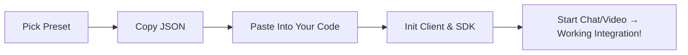

# VideoEngager UMD SDK — Hero Demo  
**Get a production-ready VideoEngager + Genesys integration in 60 seconds.**  
- ✅ One-click presets  
- 📋 Copy JSON & wrapper code to your app  
- 🚀 No build step—runs in any browser  

[](https://stackblitz.com/edit/videoengager-hero-demo)

---

## 🎥 Demo Preview  
  
_Select a scenario, copy JSON, paste into your IDE—done._

---

## 🚀 Quick Start

### 1. Grab the Demo  
```bash
git clone <REPO_URL>
cd hero-demo
````

### 2. Serve the Demo

**With Node.js:**

```bash
npx http-server . -o
```

**Note:** The SDK loader dynamically fetches scripts from a CDN. For full functionality, serve via HTTP/HTTPS rather than `file:///`.

---

## ✨ Why This Demo Rocks

* **Zero SDK leaks**
  Reload clears all state—no hidden globals.
* **Configs That Just Work**
  Inline vs. Popup × Chat On/Off presets, proven against real backends.
* **Built-in Debugging**
  Live log panel shows every action & SDK event.
* **Copy-n-Paste to Prod**
  Grab JSON + wrapper, drop into your app, and go.

---

## 🗺 Demo Flow



---

## 🎮 API Cheat Sheet

| Method                            | Description                                     |
| --------------------------------- | ----------------------------------------------- |
| `await client.init()`             | Validate config, load UMD, setup proxy          |
| `await client.ready`              | Wait for SDK `onReady`                          |
| `client.startChat()`              | Fire `GenesysMessenger.conversationStarted`     |
| `client.endChat()`                | Fire `GenesysMessenger.conversationEnded`       |
| `client.startVideo()`             | Fire `VideoEngagerCall.started`                 |
| `client.endVideo()`               | Fire `VideoEngagerCall.ended`                   |
| `client.on(eventName, callback)`  | Subscribe to any SDK event (e.g. `Gen…Started`) |
| `client.off(eventName, callback)` | Unsubscribe from events                         |

---

## 🔒 SDK Version Lock

This demo uses `genesys-hub.umd.js@latest`. For production, pin a stable version in **`VideoEngagerClient.js`**:

```diff
// In VideoEngagerClient.js → _loadScript():
- s.src = 'https://cdn.videoengager.com/widget/latest/browser/genesys-hub.umd.js';
+ s.src = 'https://cdn.videoengager.com/widget/v2.1.3/browser/genesys-hub.umd.js';
```

---

## 💻 Integrating into Your Project

1. **Copy** `public/js/VideoEngagerClient.js` into your project’s `js/` folder.
2. **Include** it in your HTML *before* your own scripts:

   ```html
   <script src="js/VideoEngagerClient.js"></script>
   ```
3. **Paste** the JSON you copied from the demo’s **Copy Config** button:

   ```js
   const cfg = { /* …demo JSON… */ };
   ```
4. **Instantiate & Initialize**:

   ```js
   const client = new VideoEngagerClient(cfg);
   await client.init();
   await client.ready;
   ```
5. **Use** the API:

   ```js
   await client.startChat();
   client.on('GenesysMessenger.conversationStarted', (e,p) => console.log('Chat started!', p));
   ```

---

## 🛠 Troubleshooting

* **Failed to load UMD**
  Check network access to `cdn.videoengager.com`.
* **Init error: Missing …**
  Validate your JSON includes `videoEngager.tenantId`, `videoEngager.veEnv`, and (if chat) `genesys.deploymentId` & `genesys.domain`.
* **Buttons stuck disabled**
  Ensure you clicked **Init SDK** and saw “✅ SDK Ready” in the log.

---

## 🔥 Feedback & Support

* **Bugs?** Open an issue with reproduction steps.
* **Urgent help?** Email **[support@videoengager.com](mailto:support@videoengager.com)**.

---

**Ready to ship**—your devs will love this frictionless, copy-paste integration guide!
