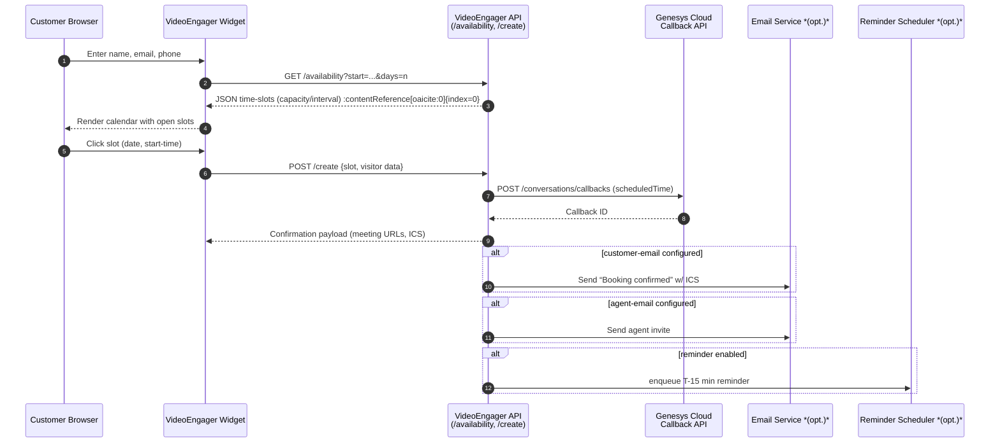
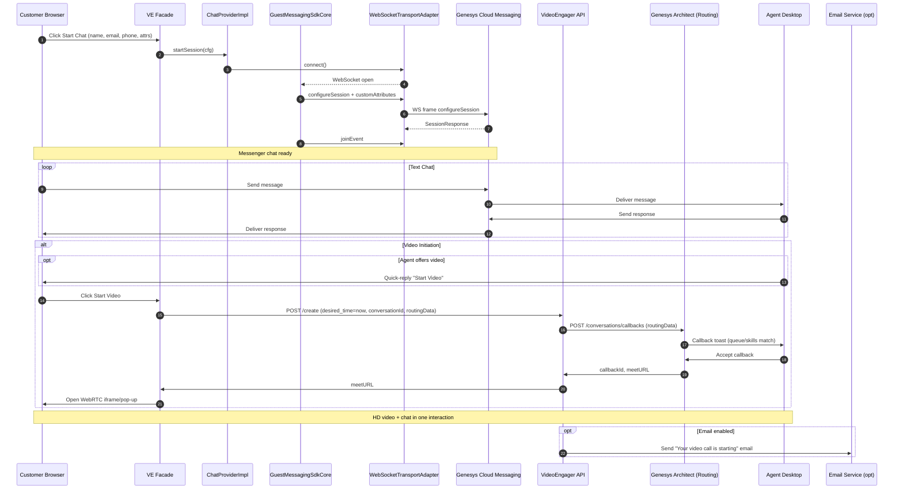

## **Scheduled video call (customer books a slot)



### Narrative for a **Scheduled Video Call** (VideoEngager + Genesys Cloud)

*(aligns to §7.2 “Scheduled entry mode” and the 8-step outline you provided)*

---

#### 1  Collect user data

The visitor opens the **“Book a video appointment”** page and fills the short form:

```json
{
  "name": "Fatima Al-Ali",
  "email": "fatima@example.ae",
  "phone": "+971-5X-XXX-XXXX",
  "productLine": "Post-paid",
  "preferredLang": "ar"
}
```

`VideoEngager.scheduleWidget.collect()` stores the payload and fires **`scheduleWidget.openCalendar()`**.
*SDK layer*: still the **facade** (`genesys-hub.umd.js`); data is cached for later submission.

---

#### 2  Check availability

The widget calls **`GET /availability`** on the VideoEngager back-end:

```
/availability?queueId=VIP-Video-Q&days=14&lang=ar
```

*Server logic*

* Pulls Genesys **Agent Schedules** + real-time capacity for *VIP-Video-Q*.
* Applies SLA buffers (min 10 min between slots) and business hours.
* Returns a JSON array of open time-slots (`startTime`, `duration`) trimmed to visitor’s locale.

---

#### 3  Visualise availability in calendar

The widget renders an inline calendar; green cells show open slots; greyed cells are full or out of hours.
Hovering a slot shows estimated wait time (“15 min”).
*(Meets §7.2 – **calendar visual** and **wait-time transparency**.)*

---

#### 4  Select available time-slot

Fatima clicks **Tue 3 Jun, 14:30 GST**.
Widget captures:

```json
{
  "scheduledTime": "2025-06-03T10:30:00Z",
  "queueId":   "VIP-Video-Q",
  "skills":    ["Arabic","Video"],
  "attributes":{ "productLine":"Post-paid" }
}
```

---

#### 5  Create schedule

The facade calls **`POST /create`** with the chosen slot and visitor data.
VideoEngager back-end does two things:

1. **Genesys Callback** –
   `POST /conversations/callbacks`

```json
{
  "callbackUserName":"Fatima Al-Ali",
  "callbackNumbers":["+9715XXXX"],
  "queueId":"VIP-Video-Q",
  "skills":["Arabic","Video"],
  "scheduledTime":"2025-06-03T10:30:00Z",
  "priority":5,
  "attributes":{"productLine":"Post-paid"}
}
```

2. **Tenant DB** – commits a scheduling record so the widget UI can show “Booking confirmed”.

Genesys Cloud now has a **scheduled callback** that Architect will route at 14:30 GST on 3 Jun.

---

#### 6  \[Optional]  Customer e-mail confirmation

If the tenant flag **`sendCustomerEmail=true`** is on, VideoEngager calls its SMTP/SES service:

* Subject: *“Your video appointment is booked”*
* Body: meeting details + **ICS attachment** (add-to-calendar)
* Branding uses e& UAE logo + colours.

---

#### 7  \[Optional]  Agent e-mail/ICS

If **`notifyAgent=true`**, the back-end looks up the **agent group** tied to *VIP-Video-Q* and sends each member an event invite (or just the assigned advisor if workforce-mgmt pre-assignment is enabled).

---

#### 8  \[Optional]  Reminder notification

With **`reminderOffset=15`** minutes, the back-end inserts a job in its **Reminder Scheduler**:

```
runAt = scheduledTime - 15 min
action = sendReminderEmail(visitorEmail, meetURL)
```

SMS can be added by pointing the same job to CPaaS SMS.

---

#### Day-of execution (what happens at 14:30 GST)

1. **Genesys Architect** wakes the callback, uses the stored
   *queue + skills + attributes* to find an available Arabic-video agent.
2. Agent desktop pops a **VideoEngager toast**; accepting opens the WebRTC room.
3. Customer clicks the link in the reminder e-mail (or the original confirmation) and lands directly in the room.
4. Because the callback and the visitor appointment share the **same attribute set**, reporting and compliance show a single, attribute-rich interaction.

---

### How this fulfils §7.2 “Scheduled entry” requirements

| §7.2 Need                          | Implementation in flow above                                       |
| ---------------------------------- | ------------------------------------------------------------------ |
| **Two-click calendar booking**     | Steps 2–4 with `/availability` + visual widget                     |
| **Masked PII**                     | Genesys org-level masking rules still apply to scheduled callbacks |
| **Queue & skill-based routing**    | `queueId`, `skills`, `attributes` passed in callback object        |
| **Customer & agent notifications** | Steps 6-7, configurable flags                                      |
| **Reminder**                       | Step 8, offset-driven scheduler                                    |
| **Multimedia tools at call time**  | Same VideoEngager WebRTC room (screen-share, annotations, etc.)    |

That’s the complete business and technical story your stakeholders will want to hear for the *scheduled* path. Let me know if you’d like a fresh Mermaid diagram or code snippets for the `/availability` handler!

---
### Narrative for the **ad-hoc video call on top of Genesys Messenger**

---
#### 1  Data collected

The visitor presses **Start Chat** on your page.

```js
VideoEngager.startGenesysChat({
  deploymentId,
  locale,
  visitor: { name, email, phone }, // ← data you want Architect to see
  customAttributes: { productLine: "Post-paid", lang: "ar" }
});
```

*Where the code lives* – the call lands in **`ChatProviderImpl.startSession()`**, which stores the visitor and attribute bundle in `_initialAttributes` for later transmission.&#x20;

---

#### 2  Session with data is initiated

1. **Transport handshake** – `WebSocketTransportAdapter.connect()` opens the secure socket to Genesys.&#x20;
2. **Core session configure** – `GuestMessagingSdkCore` sends a **`configureSession`** frame whose body already contains the `customAttributes` object above.
3. Genesys responds with `SessionResponse`; the provider flips to **READY** and the chat UI appears.
   *Result*: a Messenger interaction now exists in Genesys Cloud with the attributes `productLine=Post-paid`, `lang=ar`, etc.

---

#### 3  Genesys Architect routing (attribute–based)

When the customer (or the agent) clicks **Start Video**, the façade invokes:

```js
VideoEngager.startVideoChatSession(conversationId, {
  queueId: "VIP-Video-Q",
  skills: ["Arabic", "Video"],
  priority: 5,
  attributes: { productLine: "Post-paid" }
});
```

*Backend flow*

1. **VideoEngager** POSTs `/create` with `desired_time=now` and the **Messenger `conversationId`**.
2. VideoEngager immediately calls **`POST /conversations/callbacks`** in Genesys Cloud with:

```json
{
  "conversationId": "…",
  "routingData": {
    "queueId": "VIP-Video-Q",
    "skills": ["Arabic","Video"],
    "priority": 5,
    "attributes": { "productLine": "Post-paid" }
  },
  "callbackNumbers": ["+971…"],
  "callbackUserName": "Visitor name"
}
```

3. **Architect** looks at that `routingData` exactly as it would for any other media type:

   * **Queue** → “VIP-Video-Q”
   * **Skills** → Arabic + Video
   * **Attributes** → `productLine = Post-paid` (used in Decision / Data Action blocks)
   * **Priority** → 5 (overrides default)

Because the new Callback object is **attached to the existing Messenger conversation**, Architect treats it as a *multimedia continuation* of the same interaction; all attributes from the Messenger leg are still present.

---

#### 4  Delivered to the agent

*What the agent sees*

1. The agent who matches **queue + skills** and is next in line receives an **immediate video-callback toast** in the Genesys desktop.
2. Accepting the call automatically:

   * Opens the VideoEngager WebRTC window (HD video, screen-share, etc.).
   * Keeps the **Messenger chat panel live** for parallel text/chat.
3. Because both legs share the same interactionId, the agent’s timeline, recording, and analytics all show **one unified record** of *chat ➜ video*.

---

### Why this flow satisfies §7.2 for “Immediate entry”

| §7.2 demand                        | Implemented how                                                                |
| ---------------------------------- | ------------------------------------------------------------------------------ |
| **Data capture & transfer**        | `customAttributes` passed through the SDK → `configureSession` → Architect     |
| **Immediate video escalation**     | `desired_time = now` in `/create`                                              |
| **Attribute-based routing**        | `queueId`, `skills`, `priority`, `attributes` in `routingData` drive Architect |
| **Full multimedia tool-set**       | VideoEngager WebRTC room inherits screen-share, annotation, remote-control     |
| **Unified analytics & compliance** | Messenger + Callback combined under one interactionId                          |

This is precisely the path the diagram depicts: **data collected → session configured with those attributes → Architect routes on them → agent receives a single, attribute-aware video interaction**.

