# VideoEngager OUTBOUND Interaction Demo

A reference implementation of the VideoEngager Interactions API flow:
**impersonate → get a bearer token → create an OUTBOUND interaction → load
the agent and visitor join views.** Built to be read, copied from, and
extended — not just clicked through.

The API-calling code lives in one reusable module
(`public/js/videoengager-client.js`), separate from this demo page's UI
and from styling, so it can be lifted into a real integration as-is. See
[Project structure](#project-structure) below.

## Getting a Partner API Key (PAK)

You'll need a PAK, external ID, and email before either quick-start option
below will authenticate. In the VideoEngager admin portal: **Settings →
Developer tab**. That tab is only visible to a user whose role grants that
permission, or who holds the **Super Admin** prebuilt role — if you don't
see it, ask whoever administers your VideoEngager account to either grant
that permission on your role or generate the key for you.

Treat the PAK the same way you'd treat a password once you have it — see
[Security](#security-where-should-the-pak-live) below.

## Quick start

**Option A — zero dependencies, static only:**

```bash
cd public && python3 -m http.server 8080
# open http://localhost:8080/outbound-demo.html
```

This calls VideoEngager's impersonate endpoint directly from the browser.
Fine for local testing. Read [Security](#security-where-should-the-pak-live)
before doing this anywhere a real user's browser is involved.

**Option B — with the secure proxy (recommended, still zero npm deps):**

```bash
cp .env.example .env   # fill in VE_PAK
node server/secure-proxy.js
# open http://localhost:8787
```

This serves the same demo but keeps the Partner API Key server-side — the
browser only ever sees the short-lived token. Node 18+ only, no
`npm install` needed.

In `public/js/outbound-demo.js`, point the client at the proxy:

```js
let client = new VideoEngagerClient({ impersonateProxyUrl: '/api/token/impersonate' });
```

## Architecture

```mermaid
sequenceDiagram
    participant Browser
    participant Backend as Your backend (optional: server/secure-proxy.js)
    participant VE as VideoEngager API

    rect rgb(30,42,58)
    note over Browser,VE: Auth (Option B — recommended)
    Browser->>Backend: POST /api/token/impersonate {externalId, email}
    Backend->>VE: GET /api/partners/impersonate/{PAK}/{externalId}/{email}
    VE-->>Backend: {token, token_expiration}
    Backend-->>Browser: {token, token_expiration}  (PAK stays server-side)
    end

    Browser->>VE: POST /api/interactions  (Authorization: Bearer token)
    VE-->>Browser: {interactionId, agent.fullUrl, visitor.fullUrl}
    Browser->>VE: iframe src = agent.fullUrl (+ token)
    Browser->>VE: iframe src = visitor.fullUrl
```



## Project structure

```
├── AGENTS.md                        conventions for extending this repo (read before adding code)
├── openapi/
│   ├── interactions.yaml            Interactions API spec (source of truth for the client)
│   └── partners-impersonate.yaml    impersonate endpoint spec (reverse-documented — see file header)
├── public/
│   ├── outbound-demo.html           markup only
│   ├── style.css                    shared visual system (CSS custom properties)
│   └── js/
│       ├── videoengager-client.js   the reusable SDK — the only file that calls fetch()
│       ├── ui-helpers.js            generic UI utilities (toast, JSON highlighting, clipboard, storage)
│       └── outbound-demo.js         this page's controller (wires DOM ↔ client)
├── server/
│   └── secure-proxy.js              zero-dependency reference backend for the impersonate step
└── .env.example
```

## API reference

Everything below is implemented as a method on `VideoEngagerClient`
(`public/js/videoengager-client.js`) and specified in `openapi/`. Method
names map to `operationId`s so you can jump between the two.

| Method | operationId | Auth | Spec |
|---|---|---|---|
| `impersonate({pak, externalId, email})` | `impersonatePartner` | none (PAK is the credential) | `partners-impersonate.yaml` |
| `createVisitorInteraction({tenantId, customData, options?, visitorData?})` | `createInteractionByVisitor` | none — public widget entry point | `interactions.yaml` |
| `createAgentInteraction({token, type?, customData?, options?})` | `createInteractionByAgent` | bearer | `interactions.yaml` |
| `getVisitorProjection({interactionId})` | `getInteractionByVisitor` | none | `interactions.yaml` |
| `getAgentProjection({interactionId, token})` | `getInteractionByAgent` | bearer | `interactions.yaml` |
| `updateInteractionAttributes({interactionId, token, updates})` | `updateInteractionByAgent` | bearer | `interactions.yaml` |
| `updateInteractionAgent({interactionId, token, payload})` | `updateInteractionByAgent` (generic) | bearer | `interactions.yaml` |
| `unwrapVisitorData({interactionId, otip})` | `unwrapVisitorData` | OTIP header | `interactions.yaml` |
| `invalidateInteraction({interactionId, token})` | `invalidateByAgent` | bearer | `interactions.yaml` |
| `getFeedback({interactionId})` | `getFeedbackForInteraction` | none | `interactions.yaml` |
| `createFeedback({interactionId, feedback})` | `createFeedbackForInteraction` | none | `interactions.yaml` |
| `updateAnalyticsByExternalId({externalId, speechandtextanalytics})` | `updateByExternalId` | none | `interactions.yaml` |

The demo page only exercises `impersonate` + `createAgentInteraction`
(the OUTBOUND flow), but every other endpoint in the spec has a
ready-to-use method — see [AGENTS.md](./AGENTS.md) for how to wire one
into a new demo page.

## Security: where should the PAK live?

A Partner API Key authenticates your **entire partner tenant** — it's
equivalent to a password, not an API-usage-tracking key. Calling the
impersonate endpoint directly from the browser (Option A above) puts the
PAK in that browser's network tab, devtools, and history for anyone with
access to the machine (or to a saved HAR file, or to a browser extension
with network permissions).

- **Local testing, just you, throwaway PAK:** calling VideoEngager directly
  from the browser (`public/js/outbound-demo.js`'s default) is a reasonable
  tradeoff for speed.
- **Anything a teammate, a demo audience, or a real user's browser will
  run:** use `server/secure-proxy.js` (or the equivalent in your own
  backend). The PAK lives in an environment variable on your server; the
  browser only ever receives the short-lived bearer token.

The bearer token itself is also saved to `localStorage` in this demo for
convenience across page reloads (`bindPersistentField` in
`ui-helpers.js`). A token in `localStorage` is readable by any script that
runs on the page, so this is a demo convenience, not a pattern to carry
into a production single-page app without further thought (httpOnly
cookies or in-memory storage are the usual alternatives there).

## Design notes

No build step, no TypeScript, no test suite, no framework, no npm
dependencies anywhere in the project — every piece runs as-is in a browser
or in plain Node. That's intentional: this is meant to be read top-to-bottom
in a few minutes and lifted into your own stack, not consumed as a
packaged library.
