# VideoEngager Standalone Demo

> **Official VideoEngager Demo** - Complete standalone implementation for both agents and visitors without external contact center dependencies.

## Overview

This project provides ready-to-use demonstrations of VideoEngager's video calling capabilities in standalone mode:

- **🎧 Agent Demo**: Receive and manage incoming video calls using the VideoEngager Agent SDK
- **👤 Visitor Demo**: Initiate video calls using the VideoEngager REST API

### What is Standalone Mode?

Standalone mode enables VideoEngager video calls without requiring third-party contact center platforms. This gives you complete control over:

- ✅ Agent availability and queue management
- ✅ Call routing and distribution logic  
- ✅ Visitor experience and UI customization
- ✅ Integration with your existing systems

## Project Structure

```
videoengager-standalone/
├── index.html              # Central configuration page
├── README.md              # This file
│
├── agent/                 # Agent application
│   ├── index.html         # Agent interface
│   ├── main.mjs          # Business logic (SDK integration)
│   ├── ui-handler.mjs    # UI manipulation
│   └── README.md         # Agent-specific documentation
│
└── visitor/              # Visitor application
    ├── index.html        # Visitor interface  
    ├── main.mjs         # Business logic (REST API)
    ├── ui-handler.mjs   # UI manipulation
    ├── README.md        # Visitor-specific documentation
    └── ve-core-sdk/     # Alternative SDK-based implementation
```

## Quick Start

### 1. Central Configuration

Open `index.html` in a web browser to access the central configuration page where you can:

1. Enter your VideoEngager credentials (domain, tenant ID, API key, etc.)
2. Choose between Agent Demo or Visitor Demo
3. Launch either demo in a new tab with pre-filled configuration

### 2. Agent Demo

**Purpose**: Receive incoming video calls from visitors

**Use Case**: Call center agents, support staff, sales representatives

**Documentation**: See [agent/README.md](agent/README.md) for detailed setup and usage

**Key Features**:
- Queue management (go on/off queue to receive calls)
- Incoming call notifications
- Accept/Reject calls
- Video widget integration
- Multiple concurrent call handling

### 3. Visitor Demo

**Purpose**: Initiate video calls to available agents

**Use Case**: Website visitors, customers, end users

**Documentation**: See [visitor/README.md](visitor/README.md) for detailed setup and usage

**Key Features**:
- Simple call initiation
- Optional visitor name input
- Full-screen video interface
- Call end functionality
- Repeatable calls

## Prerequisites

### For Both Agent and Visitor

- VideoEngager account with valid credentials
- Modern web browser (Chrome, Firefox, Edge, Safari)
- HTTPS or localhost (required for camera/microphone access)
- Web server to serve static files

### Required Credentials

| Credential | Used By | Description |
|------------|---------|-------------|
| **Domain** | Both | Your VideoEngager domain (e.g., `videome.leadsecure.com`) |
| **Tenant ID** | Visitor | Your tenant identifier |
| **API Key (PAK)** | Agent | Public API Key from VideoEngager |
| **Agent Email** | Agent | Agent's email address |
| **Organization ID** | Agent | Your organization identifier |
| **External ID** | Agent | Unique agent identifier |

## Architecture

### System Overview


### Call Flow

```mermaid
sequenceDiagram
    participant V as Visitor
    participant API as VE API
    participant P as VE Platform  
    participant A as Agent App
    participant Agent

    V->>API: Create call (POST /interactions)
    API-->>V: Return visitor URL
    
    V->>P: Open visitor URL
    activate P
    
    A->>P: Agent on queue
    P->>A: 🔔 Incoming call notification
    
    Agent->>A: Accept call
    A->>P: acceptCall()
    
    P->>V: Connect call
    P->>A: Open video widget
    
    Note over V,Agent: 🎥 Video Call Active
    
    Agent->>A: End call
    A->>P: endCall()
    P->>V: End notification
    deactivate P
```



## Technology Stack

### Agent Demo
- **VideoEngager Agent SDK** - npm package for receiving calls
- **Tailwind CSS** - Modern UI styling
- **Lucide Icons** - Beautiful iconography
- **ES Modules** - Clean JavaScript architecture

### Visitor Demo
- **VideoEngager REST API** - Create video call interactions
- **Iframe embedding** - Display VideoEngager UI
- **PostMessage API** - Handle call events
- **Tailwind CSS** - Consistent UI styling

## Usage Workflow

### Complete End-to-End Flow

1. **Start Configuration**
   - Open `index.html`
   - Enter all required credentials
   - Click "Continue"

2. **Launch Agent Demo**
   - Click "Agent Demo" button
   - New tab opens with agent interface
   - Agent email is pre-filled (can be modified)
   - Click "Start Agent" to connect
   - Toggle queue ON to receive calls

3. **Launch Visitor Demo**
   - Click "Visitor Demo" button
   - New tab opens with visitor interface
   - Enter optional visitor name
   - Click "Start Video Call"
   - Wait for agent to accept

4. **Handle Call**
   - Agent sees incoming call notification
   - Agent clicks "Accept" or "Reject"
   - Video call starts if accepted
   - Either party can end the call

## Development Setup

### Serving the Application

You can use any static file server. Here are some options:

**Option 1: Python**
```bash
# Python 3
cd examples/videoengager-standalone
python -m http.server 8000

# Open: http://localhost:8000
```

**Option 2: Node.js**
```bash
# Install http-server globally
npm install -g http-server

# Run
cd examples/videoengager-standalone
http-server -p 8000

# Open: http://localhost:8000
```

**Option 3: VS Code Live Server**
1. Install "Live Server" extension in VS Code
2. Right-click on `index.html`
3. Select "Open with Live Server"

### Security Considerations

#### HTTPS Requirement

Modern browsers require HTTPS (or localhost) for camera and microphone access:

- ✅ **localhost** - Works without HTTPS
- ✅ **HTTPS** - Required for production
- ❌ **HTTP (non-localhost)** - Camera/microphone will be blocked

#### CORS Configuration

If deploying on a custom domain, ensure your VideoEngager account allows your domain:

1. Contact VideoEngager support
2. Provide your domain(s) for CORS whitelisting
3. Test after configuration update

## Customization Guide

### Branding

Both agent and visitor demos use Tailwind CSS for easy customization:

**Change Primary Colors**:
```html
<!-- Replace blue/indigo gradients with your brand colors -->
<div class="bg-gradient-to-r from-blue-600 to-indigo-600">
  <!-- Change to your colors -->
</div>
```

**Add Your Logo**:
```html
<!-- In index.html header -->
<div class="bg-gradient-to-r from-blue-600 to-indigo-600 text-white p-8 text-center">
  
  <h1>VideoEngager Standalone Demo</h1>
</div>
```

### Functionality Extensions

**Add Call Metadata**:

In visitor demo, modify the API call:
```javascript
const payload = {
    type: 'OUTBOUND',
    customData: {
        source: 'your-app',
        customerType: 'premium',
        priority: 'high',
        // Add your custom fields
    }
};
```

**Implement Call Routing**:

In agent demo, add custom routing logic:
```javascript
on('incomingCall', async () => {
    const calls = getReceivedCalls();
    
    // Route based on custom logic
    const highPriority = calls.find(call => 
        call.customData?.priority === 'high'
    );
    
    if (highPriority) {
        await acceptCall(highPriority.caller.id);
    }
});
```

## Deployment

### Static Hosting Options

This demo can be deployed to any static hosting service:

**GitHub Pages**:
```bash
# Push to GitHub repository
git add .
git commit -m "Deploy VideoEngager demo"
git push origin main

# Enable GitHub Pages in repository settings
# Choose branch: main, folder: /examples/videoengager-standalone
```

**Netlify**:
```bash
# netlify.toml
[build]
  publish = "examples/videoengager-standalone"
  
[[redirects]]
  from = "/*"
  to = "/index.html"
  status = 200
```

**Vercel**:
```bash
# vercel.json
{
  "rewrites": [
    { "source": "/(.*)", "destination": "/" }
  ]
}
```

### Environment Variables

For production, consider extracting sensitive configuration:

```javascript
// config.js
export const config = {
    domain: process.env.VE_DOMAIN || 'videome.leadsecure.com',
    tenantId: process.env.VE_TENANT_ID,
    // Never expose API keys client-side in production!
    // Use a backend proxy instead
};
```

## Troubleshooting

### Common Issues

**Issue: "Missing configuration" error**

**Solution**: Ensure all required fields are filled in the configuration page before launching agent or visitor demo.

---

**Issue: Camera/microphone not accessible**

**Solutions**:
- Use HTTPS or localhost
- Check browser permissions (allow camera/microphone)
- Test on different browser (Chrome recommended)

---

**Issue: Agent not receiving calls**

**Solutions**:
1. Verify agent is online (green "Connected" status)
2. Verify agent is on queue (toggle the "Receive Calls" switch)
3. Check browser console for errors
4. Verify credentials are correct

---

**Issue: Visitor call interface not loading**

**Solutions**:
1. Check browser console for errors
2. Verify domain and tenant ID are correct
3. Ensure tenant is properly configured in VideoEngager
4. Check CORS settings

### Debug Mode

Enable detailed logging by opening browser console (F12):

**Agent Demo**:
```javascript
// Already enabled in main.mjs
init({ 
    ...config, 
    logger: true  // SDK debug logs
});
```

**Visitor Demo**:
```javascript
// All events logged to console
console.log('Call created:', response);
console.log('Iframe message:', event.data);
```

## Best Practices

### Security

1. **Never expose API keys client-side in production**
   - Use a backend proxy to handle authentication
   - Store credentials securely server-side

2. **Validate user input**
   - Sanitize visitor names and metadata
   - Implement rate limiting for API calls

3. **Monitor access**
   - Log all call attempts
   - Track failed authentication attempts

### Performance

1. **Load SDK efficiently**
   ```javascript
   // Use latest stable version
   import { init } from 'https://cdn.jsdelivr.net/npm/videoengager-agent-sdk@latest/+esm';
   ```

2. **Optimize iframe loading**
   - Pre-create iframe container
   - Use lazy loading when appropriate

3. **Handle reconnection**
   - Monitor connection status
   - Auto-reconnect on disconnection

### User Experience

1. **Provide clear status indicators**
   - Connection status
   - Queue status
   - Call states

2. **Handle errors gracefully**
   - Show user-friendly error messages
   - Provide recovery actions
   - Log technical details for debugging

3. **Test across browsers**
   - Chrome (recommended)
   - Firefox
   - Safari
   - Edge

## Additional Resources

- **Agent Documentation**: [agent/README.md](agent/README.md)
- **Visitor Documentation**: [visitor/README.md](visitor/README.md)
- **VideoEngager Agent SDK**: [npm package](https://www.npmjs.com/package/videoengager-agent-sdk)
- **Support**: support@videoengager.com

## License

This demo is provided by VideoEngager as a reference implementation. For licensing and terms of use, refer to your VideoEngager service agreement.

---

**Built with ❤️ by the VideoEngager Team**

For questions, support, or feature requests, please contact VideoEngager support.
