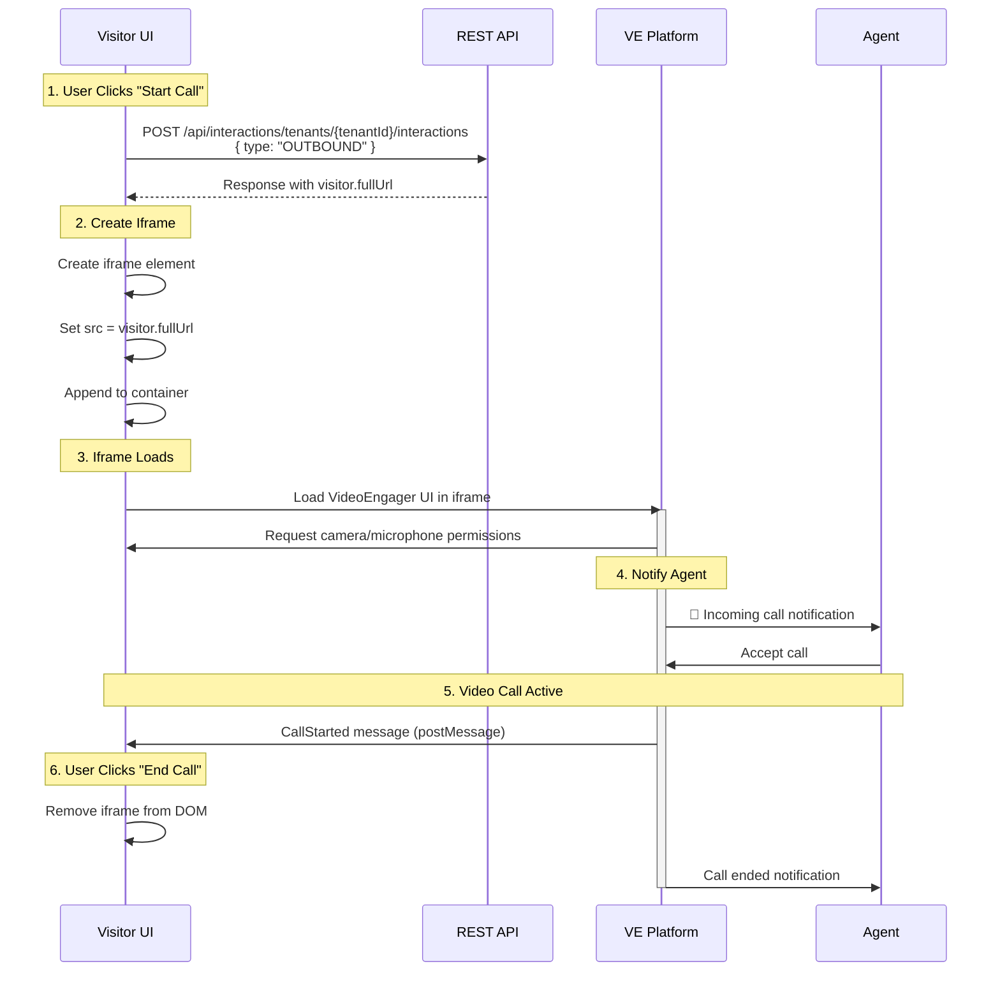

# VideoEngager Visitor Standalone Demo

> **Built by VideoEngager Team** - A demonstration of initiating VideoEngager video calls by embedding VideoEngager visitor page via iframe.

## Overview

This demo showcases how to initiate VideoEngager video calls by **embedding VideoEngager visitor page via iframe**. This approach is ideal for:

- ✅ Simple visitor implementations
- ✅ Lightweight integration
- ✅ Server-side call creation with client-side video UI
- ✅ Maximum flexibility and control
- ✅ Quick prototyping and testing

> **Note**: If you don't want to handle the hassle with iframe communication and events, see the alternative implementation using **Official VideoEngager visitor SDK** in [`ve-core-sdk/`](ve-core-sdk/README.md) folder.

## Architecture

### Call Flow Diagram



## Quick Start

### Prerequisites

- VideoEngager account with tenant ID
- Access to VideoEngager domain
- Web server to serve static files
- HTTPS or localhost (required for camera access)

### File Structure

```
visitor/
├── index.html        # Main visitor interface
├── main.mjs         # Business logic (REST API calls)
├── ui-handler.mjs   # UI manipulation functions
└── README.md        # This file
```

### Configuration

This demo integrates with the central configuration page. Required parameters:

| Field | Description | Example |
|-------|-------------|---------|
| **Domain** | Your VideoEngager domain | `videome.leadsecure.com` |
| **Tenant ID** | Your tenant identifier | `abc123def456` |

Optional visitor information:
- **Visitor Name**: Display name shown to agent

## How It Works

### Step 1: Create Video Call Interaction

Make a REST API call to create a new outbound interaction:

```javascript
async function createVideoCall(domain, tenantId) {
    const response = await fetch(
        `https://${domain}/api/interactions/tenants/${tenantId}/interactions`,
        {
            method: 'POST',
            headers: {
                'Content-Type': 'application/json'
            },
            body: JSON.stringify({ 
                type: 'OUTBOUND' 
            })
        }
    );
    
    const data = await response.json();
    return data;
}
```

**API Response**:
```json
{
    "interactionId": "int-12345",
    "visitor": {
        "fullUrl": "/visitor.html?sessionId=abc123&...",
        "shortUrl": "/v/abc123"
    },
    "agent": {
        "fullUrl": "/agent.html?sessionId=abc123&...",
        "shortUrl": "/a/abc123"  
    }
}
```

### Step 2: Create Iframe with Visitor URL

Embed the visitor URL in a fullscreen iframe:

```javascript
function createCallIframe(visitorUrl, domain, visitorName) {
    // Build full URL
    const fullUrl = new URL(visitorUrl, `https://${domain}`);
    
    // Add visitor name as query parameter (optional)
    if (visitorName) {
        fullUrl.searchParams.set('name', visitorName);
    }
    
    // Create iframe element
    const iframe = document.createElement('iframe');
    iframe.className = 'video-engager-iframe';
    iframe.src = fullUrl.toString();
    iframe.allow = 'camera; microphone; fullscreen; display-capture; autoplay';
    
    // Append to container
    document.getElementById('ve-visitor-container').appendChild(iframe);
    
    return iframe;
}
```

**CSS for Fullscreen Iframe**:
```css
.video-engager-iframe {
    position: fixed !important;
    top: 0 !important;
    left: 0 !important;
    width: 100vw !important;
    height: 100vh !important;
    z-index: 9999 !important;
    border: none !important;
    margin: 0 !important;
}
```

### Step 3: Handle Call Events

Listen for postMessage events from the iframe:

```javascript
window.addEventListener('message', (event) => {
    const data = event.data;
    if (!data || typeof data !== 'object') return;
    
    console.log('Call event:', data.type);
    
    switch (data.type) {
        case 'CallStarted':
            // Agent accepted the call
            console.log('Connected to agent');
            updateStatus('Connected');
            break;
            
        case 'callEnded':
            // Call ended by agent or visitor
            console.log('Call ended');
            cleanup();
            break;
            
        case 'popupClosed':
            // Visitor closed the video UI
            console.log('Video UI closed');
            cleanup();
            break;
            
        case 'RemoteVideoStarted':
            console.log('Agent video started');
            break;
            
        case 'RemoteVideoStopped':
            console.log('Agent video stopped');
            break;
    }
});
```

### Step 4: End Call (Cleanup)

Remove the iframe when call ends:

```javascript
function endCall() {
    // Remove iframe from DOM
    if (iframe && iframe.parentNode) {
        iframe.parentNode.removeChild(iframe);
    }
    iframe = null;
    
    // Reset UI to ready state
    showStartCallSection();
    updateStatus('Ready');
}
```

## Complete Implementation Example

### Basic Usage

```javascript
// 1. Create call
const response = await fetch(
    `https://videome.leadsecure.com/api/interactions/tenants/abc123/interactions`,
    {
        method: 'POST',
        headers: { 'Content-Type': 'application/json' },
        body: JSON.stringify({ type: 'OUTBOUND' })
    }
);

const data = await response.json();

// 2. Get visitor URL
const visitorUrl = data.visitor.fullUrl;

// 3. Create iframe
const iframe = document.createElement('iframe');
iframe.src = `https://videome.leadsecure.com${visitorUrl}?name=John`;
iframe.allow = 'camera; microphone; fullscreen';
iframe.style.cssText = 'position:fixed; top:0; left:0; width:100vw; height:100vh; border:none; z-index:9999;';

// 4. Add to page
document.body.appendChild(iframe);

// 5. Listen for events
window.addEventListener('message', (e) => {
    if (e.data.type === 'callEnded') {
        iframe.remove();
    }
});
```

## API Reference

### Create Interaction Endpoint

**Endpoint**: `POST /api/interactions/tenants/{tenantId}/interactions`

**Headers**:
```
Content-Type: application/json
```

**Request Body**:
```json
{
    "type": "OUTBOUND"
}
```

**Success Response** (200 OK):
```json
{
    "interactionId": "string",
    "visitor": {
        "fullUrl": "string",
        "shortUrl": "string"
    },
    "agent": {
        "fullUrl": "string",
        "shortUrl": "string"
    }
}
```

**Error Response** (400/401/500):
```json
{
    "error": "string",
    "message": "string"
}
```

### PostMessage Events

Events sent from VideoEngager iframe to parent window:

| Event Type | When Fired | Data |
|------------|------------|------|
| `CallStarted` | Agent accepted call | `{ type: 'CallStarted' }` |
| `callEnded` | Call terminated | `{ type: 'callEnded' }` |
| `popupClosed` | User closed video UI | `{ type: 'popupClosed' }` |
| `RemoteVideoStarted` | Agent video stream started | `{ type: 'RemoteVideoStarted' }` |
| `RemoteVideoStopped` | Agent video stream stopped | `{ type: 'RemoteVideoStopped' }` |

## Code Organization

### main.mjs - Business Logic

Handles REST API communication and iframe lifecycle:

**Key Functions**:

```javascript
// Create interaction via REST API
async function createVideoCall(config) {
    const response = await fetch(
        `https://${config.domain}/api/interactions/tenants/${config.tenantId}/interactions`,
        {
            method: 'POST',
            headers: { 'Content-Type': 'application/json' },
            body: JSON.stringify({ type: 'OUTBOUND' })
        }
    );
    return await response.json();
}

// Create iframe from visitor URL
function createCallIframe(visitorUrl, domain, visitorName) {
    const fullUrl = new URL(visitorUrl, `https://${domain}`);
    if (visitorName) fullUrl.searchParams.set('name', visitorName);
    
    const iframe = document.createElement('iframe');
    iframe.src = fullUrl.toString();
    // ... styling and permissions
    return iframe;
}

// Listen for call events
function handleIframeMessage(event) {
    const data = event.data;
    switch (data.type) {
        case 'CallStarted': /* agent connected */ break;
        case 'callEnded': endCall(); break;
        case 'popupClosed': endCall(); break;
    }
}

// Main entry point
async function startCall(config) {
    const data = await createVideoCall(config);
    iframe = createCallIframe(data.visitor.fullUrl, config.domain, config.visitorName);
    container.appendChild(iframe);
}

// Cleanup
function endCall() {
    if (iframe) iframe.remove();
    iframe = null;
}
```

### ui-handler.mjs - UI Manipulation

Handles DOM manipulation and user interactions:

**Key Functions**:

```javascript
// Show error message
export function showError(message) {
    statusDiv.textContent = `❌ ${message}`;
    statusDiv.style.color = '#dc2626';
}

// Update status display
export function updateStatus(status) {
    statusDiv.textContent = status;
    statusDiv.style.color = '#3b82f6';
}

// Toggle between start/active call views
export function showActiveCall() {
    startCallSection.style.display = 'none';
    activeCallSection.style.display = 'flex';
}

export function showStartCall() {
    startCallSection.style.display = 'flex';
    activeCallSection.style.display = 'none';
}

// Input/button state management
export function getVisitorName() {
    return visitorNameInput.value.trim();
}

export function setStartCallButtonState(enabled) {
    startCallBtn.disabled = !enabled;
}

export function setEndCallButtonState(enabled) {
    endCallBtn.disabled = !enabled;
}
```

### index.html - UI Structure

Main HTML structure with Tailwind CSS styling:

```html
<!-- Start Call Section -->
<div id="startCallSection">
    <input id="visitorNameInput" placeholder="Enter your name" />
    <button id="startCallBtn">🎥 Start Call</button>
</div>

<!-- Active Call Section (hidden initially) -->
<div id="activeCallSection" style="display: none;">
    <div id="statusDiv">Connecting...</div>
    <button id="endCallBtn">End Call</button>
</div>

<!-- Iframe Container -->
<div id="ve-visitor-container"></div>
```

## Security Considerations

### HTTPS Requirement

Browser media permissions require secure context:

```javascript
if (location.protocol !== 'https:' && location.hostname !== 'localhost') {
    console.warn('⚠️ HTTPS required for camera/microphone access');
}
```

### Origin Validation

Validate postMessage events:

```javascript
window.addEventListener('message', (event) => {
    // Verify origin matches your VideoEngager domain
    const trustedOrigin = `https://${config.domain}`;
    if (event.origin !== trustedOrigin) {
        console.warn('Untrusted origin:', event.origin);
        return;
    }
    
    handleIframeMessage(event);
});
```

### Input Validation

Sanitize user input before adding to URLs:

```javascript
function sanitizeVisitorName(name) {
    return name.replace(/[<>\"']/g, '').substring(0, 50);
}
```

## Development Setup

### Option 1: Python HTTP Server

```bash
cd examples/videoengager-standalone/visitor
python -m http.server 8000
# Visit: http://localhost:8000
```

### Option 2: Node.js HTTP Server

```bash
npx http-server -p 8000
# Visit: http://localhost:8000
```

### Option 3: VS Code Live Server

1. Install "Live Server" extension
2. Right-click `index.html`
3. Select "Open with Live Server"

## Customization Guide

### Branding

Update colors, logo, and text in `index.html`:

```html
<!-- Logo -->
<div class="flex items-center gap-3">
    
    <span>Your Company</span>
</div>

<!-- Color scheme (Tailwind) -->
<button class="bg-blue-600 hover:bg-blue-700"> <!-- Change colors -->
```

### Add Custom Fields

Collect additional visitor information:

```html
<!-- Add email input -->
<input id="visitorEmailInput" type="email" placeholder="Email" />
```

```javascript
// Add to URL query parameters
fullUrl.searchParams.set('email', visitorEmail);
fullUrl.searchParams.set('phone', visitorPhone);
```

### Pre-call Validation

Validate inputs before starting call:

```javascript
function validateInputs() {
    const name = getVisitorName();
    if (!name) {
        showError('Please enter your name');
        return false;
    }
    if (name.length < 2) {
        showError('Name too short');
        return false;
    }
    return true;
}

startCallBtn.addEventListener('click', async () => {
    if (!validateInputs()) return;
    await startCall(config);
});
```

### Custom Iframe Styling

Adjust iframe appearance:

```css
/* Rounded corners instead of fullscreen */
.video-engager-iframe {
    position: fixed;
    top: 50%;
    left: 50%;
    transform: translate(-50%, -50%);
    width: 90vw;
    max-width: 1200px;
    height: 80vh;
    border-radius: 16px;
    box-shadow: 0 20px 40px rgba(0,0,0,0.3);
}
```

## Troubleshooting

### Issue: "Camera/Microphone Permission Denied"

**Cause**: Browser blocks media access on non-HTTPS sites.

**Solution**:
- Use HTTPS in production
- Use `localhost` for development
- Check browser permissions (camera icon in address bar)

### Issue: "Failed to Fetch" or CORS Error

**Cause**: Cross-origin request blocked or network issue.

**Solution**:
```javascript
// Check domain configuration
console.log('Domain:', config.domain);
console.log('Tenant ID:', config.tenantId);

// Verify URL is correct
console.log('Full API URL:', 
    `https://${config.domain}/api/interactions/tenants/${config.tenantId}/interactions`
);

// Check response status
const response = await fetch(url);
console.log('Response status:', response.status);
if (!response.ok) {
    const errorText = await response.text();
    console.error('Error response:', errorText);
}
```

### Issue: "Iframe Not Showing"

**Cause**: Container missing or CSS z-index issues.

**Solution**:
```javascript
// Verify container exists
const container = document.getElementById('ve-visitor-container');
if (!container) {
    console.error('Container not found!');
    return;
}

// Check iframe was appended
console.log('Iframe in DOM:', container.querySelector('iframe'));

// Verify iframe CSS
iframe.style.cssText = 'position:fixed; top:0; left:0; width:100vw; height:100vh; z-index:9999;';
```

### Issue: "No postMessage Events Received"

**Cause**: Origin mismatch or event listener not attached.

**Solution**:
```javascript
// Verify listener is attached
window.addEventListener('message', (event) => {
    console.log('Message received:', event.origin, event.data);
});

// Check iframe origin
iframe.addEventListener('load', () => {
    console.log('Iframe loaded from:', iframe.src);
});
```

### Issue: "Agent Not Receiving Call"

**Cause**: Agent not logged in or queue issue.

**Solution**:
1. Verify agent is logged in (see [Agent README](../agent/README.md))
2. Check agent queue status
3. Verify tenant configuration
4. Test with agent demo first

## Comparison: Iframe Embedding vs Official SDK

### Iframe Embedding (This Demo)

**Pros**:
- ✅ Simple implementation
- ✅ Full control over flow
- ✅ Lightweight (just fetch API)
- ✅ Works with any backend language

**Cons**:
- ❌ Manual iframe management
- ❌ Manual event handling via postMessage
- ❌ No TypeScript types
- ❌ More boilerplate code

**Use When**:
- Building simple visitor interfaces
- Server-side call creation
- Quick prototypes
- You want full control over iframe lifecycle

### Official VideoEngager Visitor SDK (ve-core-sdk)

**Pros**:
- ✅ Handles iframe communication automatically
- ✅ Built-in event handlers
- ✅ TypeScript support
- ✅ Better error handling
- ✅ More features (control media, UI customization)
- ✅ No hassle with postMessage events

**Cons**:
- ❌ External dependency (npm package)
- ❌ Build step required

**Use When**:
- You don't want to handle iframe communication manually
- Building complex applications
- Need advanced features
- TypeScript projects
- Long-term maintainability

**See**: [`ve-core-sdk/`](ve-core-sdk/) folder for SDK-based alternative.

## Best Practices

### 1. Error Handling

Always wrap API calls in try-catch:

```javascript
try {
    const data = await createVideoCall(config);
    // ... handle success
} catch (error) {
    console.error('Call failed:', error);
    showError('Unable to start call. Please try again.');
    // Reset UI state
    showStartCall();
}
```

### 2. State Management

Track call state clearly:

```javascript
let callState = 'idle'; // idle, connecting, active, ended

function updateCallState(newState) {
    console.log(`State: ${callState} -> ${newState}`);
    callState = newState;
    updateUI(newState);
}
```

### 3. Cleanup

Always clean up resources:

```javascript
function endCall() {
    // Remove event listener if added dynamically
    window.removeEventListener('message', messageHandler);
    
    // Remove iframe
    if (iframe && iframe.parentNode) {
        iframe.parentNode.removeChild(iframe);
    }
    iframe = null;
    
    // Reset UI
    showStartCall();
    updateStatus('Ready');
}

// Clean up on page unload
window.addEventListener('beforeunload', endCall);
```

### 4. User Feedback

Provide clear status updates:

```javascript
updateStatus('Creating call...');
const data = await createVideoCall(config);

updateStatus('Loading video interface...');
createCallIframe(data.visitor.fullUrl);

updateStatus('Waiting for agent...');
// CallStarted event -> updateStatus('Connected')
```

### 5. Testing

Test different scenarios:

```javascript
// Test error handling
try {
    await createVideoCall({ domain: '', tenantId: '' }); // Invalid config
} catch (e) {
    console.log('✓ Error handling works');
}

// Test cleanup
startCall(config);
setTimeout(endCall, 1000); // Should clean up properly

// Test multiple calls
for (let i = 0; i < 3; i++) {
    await startCall(config);
    await new Promise(r => setTimeout(r, 5000));
    endCall();
}
```

## Related Resources

### Internal Documentation

- **[Main Project README](../README.md)**: Overall project architecture and quick start
- **[Agent Demo README](../agent/README.md)**: Agent SDK implementation and receiving calls
- **[Central Configuration](../index.html)**: Starting point for demos

### VideoEngager Documentation

- **[VideoEngager Documentation](https://github.com/VideoEngager/videoengager.github.io)**: Official documentation
- **[REST API Reference](https://api.videoengager.com/docs)**: Complete API documentation
- **[Official VideoEngager Visitor SDK (ve-core-sdk)](https://videoengager.github.io/videoengager.widget/#/core/README)**: Alternative approach without iframe hassles

### External Resources

- **[MDN: postMessage API](https://developer.mozilla.org/en-US/docs/Web/API/Window/postMessage)**: Cross-origin messaging
- **[MDN: Fetch API](https://developer.mozilla.org/en-US/docs/Web/API/Fetch_API)**: HTTP requests
- **[WebRTC Security](https://webrtc-security.github.io/)**: Media permissions and security

---

**Built by VideoEngager Team** | Questions? See [main README](../README.md) or contact support.

