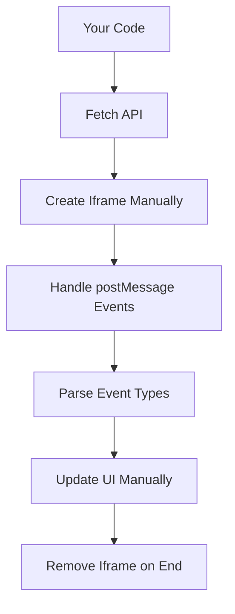
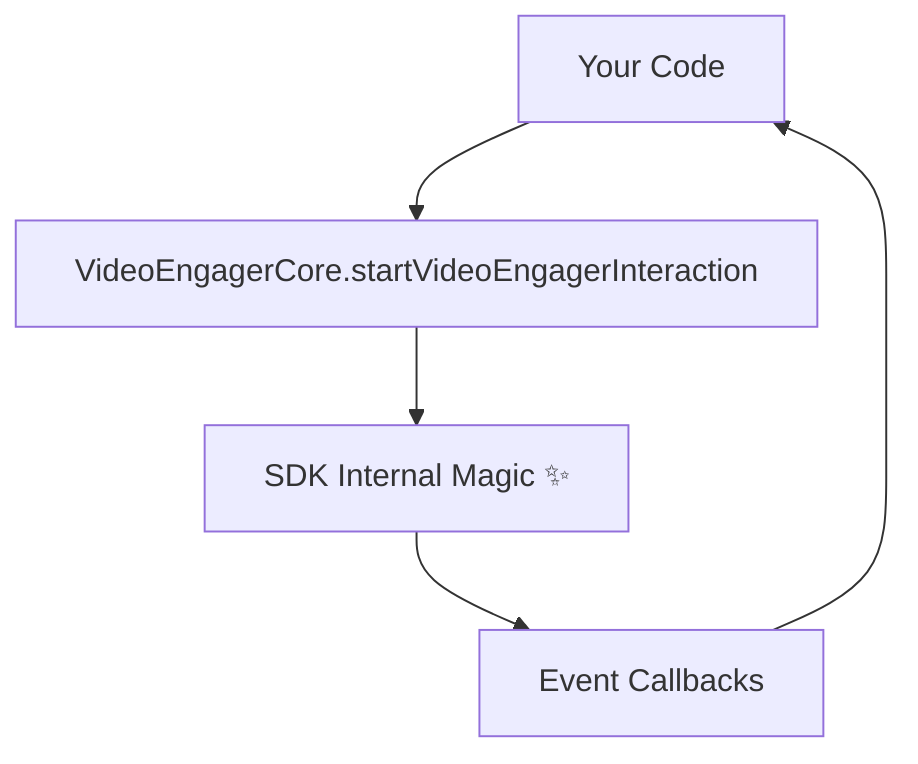

# VideoEngager Official Visitor SDK (VideoEngagerCore)

> **Built by VideoEngager Team** - Simplified video call integration using the Official VideoEngager Visitor SDK that handles iframe communication automatically.

## Overview

This implementation uses **VideoEngager's VideoEngagerCore SDK** (loaded via CDN) to eliminate the hassle of manual iframe management and postMessage event handling. The SDK provides a streamlined API for initiating and managing video calls.

### Why Use the Official SDK?

If you're coming from the [iframe embedding approach](../README.md), the SDK offers:

- ✅ **No iframe hassles**: SDK handles iframe creation, styling, and lifecycle automatically  
- ✅ **No postMessage complexity**: Built-in event system replaces manual message handling
- ✅ **Less code**: Simplified API reduces boilerplate significantly
- ✅ **Better error handling**: Comprehensive error states and recovery

## Quick Start

### Installation

Load the SDK via CDN:

```html
<script src="https://cdn.videoengager.com/widget/latest/browser/main.umd.js"></script>
```

The SDK will be available as `window.VideoEngager.VideoEngagerCore`.

### Basic Implementation

```javascript
// 1. Initialize SDK
const videoEngagerInstance = new window.VideoEngager.VideoEngagerCore({
    veHttps: true,
    veEnv: 'videome.leadsecure.com',  // Your domain
    tenantId: 'your-tenant-id',
    logger: true  // Enable console logging
});

// 2. Setup UI callbacks for iframe management
videoEngagerInstance.setUiCallbacks({
    getIframeInstance,
    createIframe,
    destroyIframe
});

// 3. Prepare the visitor URL
videoEngagerInstance.setPreparePopupHtmlUrlFn(() => visitorUrl);

// 4. Start the call
await videoEngagerInstance.startVideoEngagerInteraction({
    callConfigs: {
        interactionId: 'interaction-123'
    }
});

// 5. Listen for events
videoEngagerInstance.on('videoEngager:call-state-changed', (callState) => {
    console.log('Call state:', callState);
});

// 6. End the call
await videoEngagerInstance.endVideoEngagerInteraction();
```

## Architecture Comparison

### Before (Iframe Embedding)



**Your Responsibility**: REST API calls, iframe creation, event parsing, UI updates, cleanup.

### After (VideoEngagerCore SDK)



**Your Responsibility**: Call `startVideoEngagerInteraction()`, listen to events.

## Complete Example

See the actual implementation in this folder:
- [index.html](index.html) - UI structure
- [main.mjs](main.mjs) - Business logic
- [ui-handler.mjs](ui-handler.mjs) - UI manipulation

### HTML Structure

```html
<!DOCTYPE html>
<html lang="en">
<head>
  <meta charset="UTF-8">
  <title>VideoEngager SDK Demo</title>
  <!-- Load SDK from CDN -->
  <script src="https://cdn.videoengager.com/widget/latest/browser/main.umd.js"></script>
  <style>
    .video-engager-widget-iframe {
      position: fixed !important;
      top: 0 !important;
      left: 0 !important;
      width: 100vw !important;
      height: 100vh !important;
      z-index: 9999 !important;
      border: none !important;
    }
  </style>
</head>
<body>
  <input id="visitorName" placeholder="Your Name" />
  <button id="startCallBtn">Start Call</button>
  <button id="endCallBtn">End Call</button>
  
  <!-- Container for VideoEngager iframe -->
  <div id="ve-visitor-container"></div>
  
  <script type="module" src="main.js"></script>
</body>
</html>
```

### JavaScript Implementation

```javascript
// Initialize SDK
const videoEngagerInstance = new window.VideoEngager.VideoEngagerCore({
    veHttps: true,
    veEnv: 'videome.leadsecure.com',  // Your domain
    tenantId: 'your-tenant-id',
    logger: true
});

// Iframe management functions
let iframeInstance = null;

function getIframeInstance() {
    return iframeInstance;
}

function createIframe(src) {
    const iframe = document.createElement('iframe');
    iframe.className = 'video-engager-widget-iframe';
    iframe.allow = 'camera; microphone; display-capture; autoplay';
    iframe.src = src;
    document.getElementById('ve-visitor-container').appendChild(iframe);
    iframeInstance = iframe;
    return iframe;
}

function destroyIframe() {
    if (iframeInstance) {
        iframeInstance.remove();
        iframeInstance = null;
    }
}

// Setup UI callbacks
videoEngagerInstance.setUiCallbacks({
    getIframeInstance,
    createIframe,
    destroyIframe
});

// Start call function
async function startCall() {
    try {
        // 1. Create interaction via REST API
        const response = await fetch(
            `https://videome.leadsecure.com/api/interactions/tenants/your-tenant-id/interactions`,
            {
                method: 'POST',
                headers: { 'Content-Type': 'application/json' },
                body: JSON.stringify({ type: 'OUTBOUND' })
            }
        );
        const data = await response.json();
        
        // 2. Prepare visitor URL
        const visitorName = document.getElementById('visitorName').value;
        const visitorUrlObj = new URL(data.visitor.fullUrl, 'https://videome.leadsecure.com');
        if (visitorName) {
            visitorUrlObj.searchParams.set('name', visitorName);
        }
        
        // 3. Tell SDK which URL to use
        videoEngagerInstance.setPreparePopupHtmlUrlFn(() => visitorUrlObj.toString());
        
        // 4. Start the interaction
        await videoEngagerInstance.startVideoEngagerInteraction({
            callConfigs: {
                interactionId: data.interactionId
            }
        });
        
        console.log('Call started');
    } catch (error) {
        console.error('Failed to start call:', error);
    }
}

// End call function
async function endCall() {
    try {
        await videoEngagerInstance.endVideoEngagerInteraction();
        console.log('Call ended');
    } catch (error) {
        console.error('Failed to end call:', error);
    }
}

// Event listeners
document.getElementById('startCallBtn').addEventListener('click', startCall);
document.getElementById('endCallBtn').addEventListener('click', endCall);

// SDK event listeners
videoEngagerInstance.on('videoEngager:call-state-changed', (callState) => {
    console.log('Call state changed:', callState);
    // callState values: 'connecting', 'connected', 'disconnected', 'ended'
});

videoEngagerInstance.on('videoEngager:active-ve-instance', (veInstance) => {
    console.log('VE instance state:', veInstance ? 'opened' : 'closed');
    // veInstance will be null when iframe is closed
});
```

## API Reference

For complete API documentation including all methods and events, please refer to the official VideoEngagerCore documentation:

- **[Methods Reference](https://videoengager.github.io/videoengager.widget/#/core/api-reference/methods)** - Complete list of available methods
- **[Events Reference](https://videoengager.github.io/videoengager.widget/#/core/api-reference/events)** - Complete list of available events

## Implementation Details

### File Structure

```
ve-core-sdk/
├── index.html           # UI structure with Tailwind CSS + custom controls overlay
├── main.mjs             # Business logic and SDK integration
├── ui-handler.mjs       # UI manipulation functions
└── README.md            # This file
```

## URL Parameters

This demo accepts the following URL parameters:

| Parameter | Required | Description |
|-----------|----------|-------------|
| `domain` | Yes | VideoEngager domain (e.g., `videome.leadsecure.com`) |
| `tenantId` | Yes | Your tenant ID |
| `customizedUI` | No | Set to `true` to show custom control buttons overlay |
| `customCssGuid` | No | Custom CSS GUID to apply custom styles to the visitor page |

### Example URL

```
index.html?domain=videome.leadsecure.com&tenantId=abc123&customizedUI=true&customCssGuid=my-css-guid
```

## UI Customization

This demo supports **custom video controls** that overlay on top of the iframe. When enabled, you get a floating control bar at the bottom of the screen with:

- 🎤 **Microphone toggle** - Mute/unmute audio
- 📹 **Camera toggle** - Turn camera on/off
- 🖥️ **Screen share** - Start/stop screen sharing
- 🔄 **Camera switch** - Cycle through available cameras
- 📞 **Hangup** - End the call

### Enabling Custom Controls

1. **From the main configuration page**: Check "Use Customized UI" option
2. **Via URL parameter**: Add `customizedUI=true` to the URL

### How It Works

When `customizedUI=true`:
1. The SDK is initialized with `enableVeIframeCommands: true`
2. Custom control buttons appear when the call connects
3. Button states sync with actual call state via `videoEngager:iframe-video-state-changed` events
4. Buttons use `executeVideoCallFn()` to trigger actions

```javascript
// SDK initialized with iframe commands enabled
const videoEngagerInstance = new window.VideoEngager.VideoEngagerCore({
    veHttps: true,
    veEnv: config.domain,
    tenantId: config.tenantId,
    enableVeIframeCommands: config.customizedUI  // Enable only when needed
});

// Listen for state changes to update button UI
videoEngagerInstance.on('videoEngager:iframe-video-state-changed', (state) => {
    // state.isMicOn, state.isVideoOn, state.isScreenSharing, etc.
    updateButtonStates(state);
});

// Execute commands via SDK
await videoEngagerInstance.executeVideoCallFn('triggerMuteUnmute');
await videoEngagerInstance.executeVideoCallFn('triggerShowHideVideo');
await videoEngagerInstance.executeVideoCallFn('triggerScreenShare');
await videoEngagerInstance.executeVideoCallFn('triggerHangup');
```

### Custom CSS GUID

You can apply custom CSS to the visitor video page by providing a `customCssGuid` parameter. This GUID references a CSS configuration stored in VideoEngager settings.

When provided, the GUID is passed to the visitor URL as the `csg` parameter:

```javascript
if (config.customCssGuid) {
    visitorUrlObj.searchParams.set('csg', config.customCssGuid);
}
```

For more details on UI customization, refer to the official documentation:
- **[UI Customization Guide](https://videoengager.github.io/videoengager.widget/#/core/api-reference/customization)** - Complete customization reference
- **[VideoEngager Visitor Core SDK](https://videoengager.github.io/videoengager.widget/#/core/README)** - Full SDK documentation

### Key Implementation Steps

1. **Load SDK via CDN**
   ```html
   <script src="https://cdn.videoengager.com/widget/latest/browser/main.umd.js"></script>
   ```

2. **Initialize SDK instance**
   ```javascript
   const videoEngagerInstance = new window.VideoEngager.VideoEngagerCore({
       veHttps: true,
       veEnv: config.domain,
       tenantId: config.tenantId,
       logger: true
   });
   ```

3. **Setup iframe callbacks**
   ```javascript
   videoEngagerInstance.setUiCallbacks({
       getIframeInstance,
       createIframe,
       destroyIframe
   });
   ```

4. **Create interaction via REST API**
   ```javascript
   const response = await fetch(
       `https://${domain}/api/interactions/tenants/${tenantId}/interactions`,
       {
           method: 'POST',
           headers: { 'Content-Type': 'application/json' },
           body: JSON.stringify({ type: 'OUTBOUND' })
       }
   );
   const data = await response.json();
   ```

5. **Configure visitor URL**
   ```javascript
   const visitorUrlObj = new URL(data.visitor.fullUrl, `https://${domain}`);
   visitorUrlObj.searchParams.set('name', visitorName);
   
   videoEngagerInstance.setPreparePopupHtmlUrlFn(() => visitorUrlObj.toString());
   ```

6. **Start interaction**
   ```javascript
   await videoEngagerInstance.startVideoEngagerInteraction({
       callConfigs: { interactionId: data.interactionId }
   });
   ```

7. **Handle events**
   ```javascript
   videoEngagerInstance.on('videoEngager:call-state-changed', (callState) => {
       if (callState === 'connected') {
           // Update UI
       }
   });
   ```

8. **End call**
   ```javascript
   await videoEngagerInstance.endVideoEngagerInteraction();
   ```

## Code Comparison: Iframe vs SDK

### Iframe Approach (Manual)

```javascript
// 40+ lines of code

// 1. Fetch API to create interaction
const response = await fetch(`https://${domain}/api/interactions/tenants/${tenantId}/interactions`, {
  method: 'POST',
  headers: { 'Content-Type': 'application/json' },
  body: JSON.stringify({ type: 'OUTBOUND' })
});
const data = await response.json();

// 2. Create iframe manually
const iframe = document.createElement('iframe');
iframe.src = `https://${domain}${data.visitor.fullUrl}?name=${name}`;
iframe.allow = 'camera; microphone; fullscreen';
iframe.style.cssText = 'position:fixed; top:0; left:0; width:100vw; height:100vh; ...';
document.body.appendChild(iframe);

// 3. Handle postMessage events
window.addEventListener('message', (event) => {
  if (event.origin !== trustedOrigin) return;
  
  const data = event.data;
  switch (data.type) {
    case 'CallStarted':
      console.log('Connected');
      break;
    case 'callEnded':
      iframe.remove();
      break;
    // ... more cases
  }
});

// 4. Cleanup
function endCall() {
  if (iframe && iframe.parentNode) {
    iframe.parentNode.removeChild(iframe);
  }
  iframe = null;
}
```

### SDK Approach (Simplified)

```javascript
// 20 lines of code

// 1. Initialize SDK
const videoEngagerInstance = new window.VideoEngager.VideoEngagerCore({
    veHttps: true,
    veEnv: domain,
    tenantId: tenantId,
    logger: true
});

// 2. Setup callbacks (one-time setup)
videoEngagerInstance.setUiCallbacks({ getIframeInstance, createIframe, destroyIframe });

// 3. Create interaction (same as before)
const response = await fetch(`https://${domain}/api/...`);
const data = await response.json();

// 4. Configure and start
const visitorUrl = new URL(data.visitor.fullUrl, `https://${domain}`);
videoEngagerInstance.setPreparePopupHtmlUrlFn(() => visitorUrl.toString());
await videoEngagerInstance.startVideoEngagerInteraction({
    callConfigs: { interactionId: data.interactionId }
});

// 5. Listen to events (cleaner)
videoEngagerInstance.on('videoEngager:call-state-changed', (state) => {
    console.log('State:', state);
});

// 6. End call (one line)
await videoEngagerInstance.endVideoEngagerInteraction();
```

**Result**: No postMessage handling, automatic iframe lifecycle management.

## Best Practices

### 1. Initialize Once

Create the SDK instance once and reuse it:

```javascript
// Good ✅
const videoEngagerInstance = new window.VideoEngager.VideoEngagerCore(config);
// Use videoEngagerInstance for all calls

// Bad ❌
async function startCall() {
  const videoEngagerInstance = new window.VideoEngager.VideoEngagerCore(config); // Don't recreate
}
```

### 2. Setup Callbacks Early

Call `setUiCallbacks()` immediately after initialization:

```javascript
const videoEngagerInstance = new window.VideoEngager.VideoEngagerCore(config);
videoEngagerInstance.setUiCallbacks({
    getIframeInstance,
    createIframe,
    destroyIframe
});
```

### 3. Handle Both Events

Listen to both SDK events:

```javascript
videoEngagerInstance.on('videoEngager:call-state-changed', (callState) => {
    console.log('Call state:', callState);
    // Update UI based on state
});

videoEngagerInstance.on('videoEngager:active-ve-instance', (veInstance) => {
    if (!veInstance) {
        // Iframe closed - clean up UI
    }
});
```

### 4. Add Visitor Name to URL

Always add visitor name as query parameter for better agent experience:

```javascript
const visitorUrlObj = new URL(data.visitor.fullUrl, `https://${domain}`);
if (visitorName) {
    visitorUrlObj.searchParams.set('name', visitorName);
}
```

### 5. Error Handling

Wrap SDK calls in try-catch:

```javascript
try {
    await videoEngagerInstance.startVideoEngagerInteraction({
        callConfigs: { interactionId: data.interactionId }
    });
} catch (error) {
    console.error('Failed to start call:', error);
    // Show user-friendly message
}
```

## Troubleshooting

### Issue: "SDK not loaded"

**Cause**: CDN script not loaded or wrong path.

**Solution**:
```html
<!-- Make sure script is loaded BEFORE your code -->
<script src="https://cdn.videoengager.com/widget/latest/browser/main.umd.js"></script>
<script type="module" src="main.js"></script>
```

```javascript
// Check if SDK is available
if (window.VideoEngager && window.VideoEngager.VideoEngagerCore) {
    console.log('SDK loaded successfully');
} else {
    console.error('SDK not loaded');
}
```

### Issue: "Failed to start call"

**Cause**: Invalid configuration, REST API error, or network issue.

**Solution**:
```javascript
// Enable logger to see SDK debug logs
const videoEngagerInstance = new window.VideoEngager.VideoEngagerCore({
    veHttps: true,
    veEnv: config.domain,
    tenantId: config.tenantId,
    logger: true  // <-- Enable this
});

// Check REST API response
const response = await fetch(`https://${domain}/api/...`);
console.log('API Status:', response.status);
const data = await response.json();
console.log('API Response:', data);

// Check interaction ID
console.log('Interaction ID:', data.interactionId);
```

### Issue: "Iframe not showing"

**Cause**: `createIframe` function not creating iframe correctly.

**Solution**:
```javascript
function createIframe(src) {
    console.log('Creating iframe with src:', src);
    
    const iframe = document.createElement('iframe');
    iframe.className = 'video-engager-widget-iframe';
    iframe.allow = 'camera; microphone; display-capture; autoplay';
    iframe.src = src;
    
    const container = document.getElementById('ve-visitor-container');
    if (!container) {
        console.error('Container not found!');
        return null;
    }
    
    container.appendChild(iframe);
    iframeInstance = iframe;
    
    console.log('Iframe created:', iframe);
    return iframe;
}
```

### Issue: "Events not firing"

**Cause**: Event listeners attached after call starts.

**Solution**:
```javascript
// Attach listeners BEFORE starting call
videoEngagerInstance.on('videoEngager:call-state-changed', handleStateChange);
videoEngagerInstance.on('videoEngager:active-ve-instance', handleVeInstance);

// Then start call
await videoEngagerInstance.startVideoEngagerInteraction(...);
```

### Issue: "Camera/microphone permission denied"

**Cause**: Browser blocks media access on non-HTTPS sites.

**Solution**:
- Use HTTPS in production
- Use `localhost` for development
- Check browser permissions (camera icon in address bar)

## Related Resources

### Internal Documentation

- **[Iframe Embedding Approach](../README.md)**: Manual implementation without SDK
- **[Main Project README](../../README.md)**: Overall project architecture
- **[Agent Demo](../../agent/README.md)**: Agent SDK implementation

### Official Documentation

- **[VideoEngager Documentation](https://github.com/VideoEngager/videoengager.github.io)**: Platform documentation
- **[REST API Reference](https://api.videoengager.com/docs)**: API documentation
- **[VideoEngager Widget Docs](https://videoengager.github.io/videoengager.widget/)**: Widget documentation

---

**Built by VideoEngager Team** | Questions? See [main README](../../README.md) or contact support.